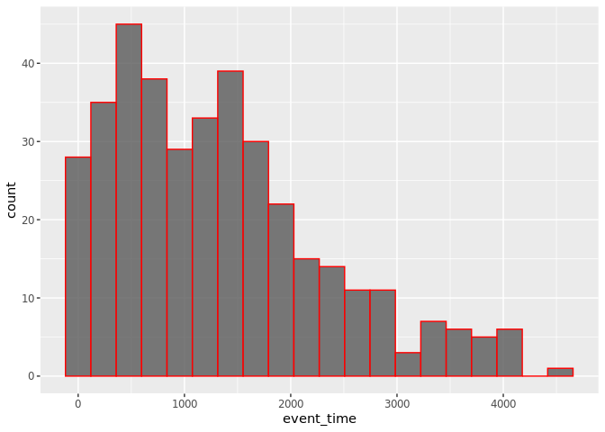

A Preprocessing analysis of clinical data of TCGA-KIRC patients and
building a model with mrl3
================

This project contains a pipeline for analysis of The Cancer Genome Atlas
Kidney - Renal Clear Cell Carcinoma (TCGA-KIRC) clinical data, from
[Genomic Data Commons Data
Portal](https://portal.gdc.cancer.gov/exploration?filters=%7B%22op%22%3A%22and%22%2C%22content%22%3A%5B%7B%22op%22%3A%22in%22%2C%22content%22%3A%7B%22field%22%3A%22cases.project.project_id%22%2C%22value%22%3A%5B%22TCGA-KIRC%22%5D%7D%7D%5D%7D)
and [cBioPortal](https://www.cbioportal.org/study/summary?id=kirp_tcga).

In this section, the initial preprocessing is applied to clean the data
and arrange following the Tidyverse philosophy. Exploratory Data
Analysis summarizes their main characteristics.

``` r
# Avoid duplicate label error of knitr::purl
options(knitr.duplicate.label = 'allow')
# Code to browse the markdown file with renderized images.
knitr::opts_chunk$set(
  fig.path = "figs/1-prep_"
)
```

# Intro

First of all we are going to load required packages and the data. The
data is part of the mlr3data package.

``` r
if(!require("mlr3")){install.packages("mlr3")}
```

    ## Loading required package: mlr3

``` r
if(!require("mlr3learners")){install.packages("mlr3learners")}
```

    ## Loading required package: mlr3learners

``` r
if(!require("mlr3pipelines")){install.packages("mlr3pipelines")}
```

    ## Loading required package: mlr3pipelines

``` r
if(!require("mlr3data")){install.packages("mlr3data")}
```

    ## Loading required package: mlr3data

``` r
if(!require("mlr3misc")){install.packages("mlr3misc")}
```

    ## Loading required package: mlr3misc

``` r
if(!require("mlr3viz")){install.packages("mlr3viz")}
```

    ## Loading required package: mlr3viz

``` r
if(!require("skimr")){install.packages("skimr")} # Compact and Flexible Summaries of Data
```

    ## Loading required package: skimr

``` r
if(!require("finalfit")){install.packages("finalfit")} #  Quickly Create Elegant Regression Results Tables and Plots when Modelling
```

    ## Loading required package: finalfit

``` r
if(!require("tidyverse")){install.packages("tidyverse")} # R packages for data science
```

    ## Loading required package: tidyverse

    ## Warning in system("timedatectl", intern = TRUE): execução do comando
    ## 'timedatectl' teve status 1

    ## ── Attaching packages ─────────────────────────────────────── tidyverse 1.3.0 ──

    ## ✓ ggplot2 3.3.3     ✓ purrr   0.3.4
    ## ✓ tibble  3.1.0     ✓ dplyr   1.0.4
    ## ✓ tidyr   1.1.2     ✓ stringr 1.4.0
    ## ✓ readr   1.4.0     ✓ forcats 0.5.1

    ## ── Conflicts ────────────────────────────────────────── tidyverse_conflicts() ──
    ## x forcats::as_factor() masks mlr3misc::as_factor()
    ## x purrr::compose()     masks mlr3misc::compose()
    ## x purrr::detect()      masks mlr3misc::detect()
    ## x purrr::discard()     masks mlr3misc::discard()
    ## x tibble::enframe()    masks mlr3misc::enframe()
    ## x purrr::every()       masks mlr3misc::every()
    ## x dplyr::filter()      masks stats::filter()
    ## x purrr::has_element() masks mlr3misc::has_element()
    ## x purrr::imap()        masks mlr3misc::imap()
    ## x purrr::imap_chr()    masks mlr3misc::imap_chr()
    ## x purrr::imap_dbl()    masks mlr3misc::imap_dbl()
    ## x purrr::imap_int()    masks mlr3misc::imap_int()
    ## x purrr::imap_lgl()    masks mlr3misc::imap_lgl()
    ## x purrr::invoke()      masks mlr3misc::invoke()
    ## x purrr::keep()        masks mlr3misc::keep()
    ## x dplyr::lag()         masks stats::lag()
    ## x purrr::map()         masks mlr3misc::map()
    ## x purrr::map_at()      masks mlr3misc::map_at()
    ## x purrr::map_chr()     masks mlr3misc::map_chr()
    ## x purrr::map_dbl()     masks mlr3misc::map_dbl()
    ## x purrr::map_if()      masks mlr3misc::map_if()
    ## x purrr::map_int()     masks mlr3misc::map_int()
    ## x purrr::map_lgl()     masks mlr3misc::map_lgl()
    ## x purrr::modify_if()   masks mlr3misc::modify_if()
    ## x purrr::pmap()        masks mlr3misc::pmap()
    ## x purrr::pmap_chr()    masks mlr3misc::pmap_chr()
    ## x purrr::pmap_dbl()    masks mlr3misc::pmap_dbl()
    ## x purrr::pmap_int()    masks mlr3misc::pmap_int()
    ## x purrr::pmap_lgl()    masks mlr3misc::pmap_lgl()
    ## x purrr::set_names()   masks mlr3misc::set_names()
    ## x purrr::some()        masks mlr3misc::some()
    ## x stringr::str_trunc() masks mlr3misc::str_trunc()
    ## x tidyr::unnest()      masks mlr3misc::unnest()

``` r
if(!require("janitor")){install.packages("janitor")} # Simple Tools for Examining and Cleaning Dirty Data
```

    ## Loading required package: janitor

    ## 
    ## Attaching package: 'janitor'

    ## The following objects are masked from 'package:stats':
    ## 
    ##     chisq.test, fisher.test

# Loading data

``` r
load("data/tcga_kirc.RData")

#save(kirc_rna, kirc_snv, kirc_cli, file="data/tcga_kirc.RData", compress = T)
```

# Exploratory Data Analysis

We can use the skimr package in order to get a first overview of the
data:

``` r
## clinical data size : 
dim(kirc_cli)
```

    ## [1] 378 154

``` r
skimr::skim(kirc_cli)
```

|                                                  |           |
| :----------------------------------------------- | :-------- |
| Name                                             | kirc\_cli |
| Number of rows                                   | 378       |
| Number of columns                                | 154       |
| \_\_\_\_\_\_\_\_\_\_\_\_\_\_\_\_\_\_\_\_\_\_\_   |           |
| Column type frequency:                           |           |
| character                                        | 77        |
| logical                                          | 41        |
| numeric                                          | 36        |
| \_\_\_\_\_\_\_\_\_\_\_\_\_\_\_\_\_\_\_\_\_\_\_\_ |           |
| Group variables                                  | None      |

Data summary

**Variable type: character**

| skim\_variable                                   | n\_missing | complete\_rate | min | max | empty | n\_unique | whitespace |
| :----------------------------------------------- | ---------: | -------------: | --: | --: | ----: | --------: | ---------: |
| submitter\_id                                    |          0 |           1.00 |  12 |  12 |     0 |       378 |          0 |
| case\_id                                         |          0 |           1.00 |  36 |  36 |     0 |       378 |          0 |
| project\_id                                      |          0 |           1.00 |   9 |   9 |     0 |         1 |          0 |
| gender                                           |          0 |           1.00 |   4 |   6 |     0 |         2 |          0 |
| race                                             |          0 |           1.00 |   5 |  25 |     0 |         4 |          0 |
| vital\_status                                    |          0 |           1.00 |   4 |   5 |     0 |         2 |          0 |
| classification\_of\_tumor                        |          0 |           1.00 |  12 |  12 |     0 |         1 |          0 |
| last\_known\_disease\_status                     |          0 |           1.00 |  12 |  12 |     0 |         1 |          0 |
| tumor\_grade                                     |          0 |           1.00 |  12 |  12 |     0 |         1 |          0 |
| tissue\_or\_organ\_of\_origin                    |          0 |           1.00 |  11 |  11 |     0 |         1 |          0 |
| progression\_or\_recurrence                      |          0 |           1.00 |  12 |  12 |     0 |         1 |          0 |
| prior\_malignancy                                |          0 |           1.00 |  12 |  12 |     0 |         1 |          0 |
| site\_of\_resection\_or\_biopsy                  |          0 |           1.00 |  11 |  11 |     0 |         1 |          0 |
| submitter\_id.samples                            |          0 |           1.00 |  16 |  16 |     0 |       378 |          0 |
| additional\_pharmaceutical\_therapy              |        283 |           0.25 |   2 |   3 |     0 |         2 |          0 |
| additional\_radiation\_therapy                   |        283 |           0.25 |   2 |   3 |     0 |         2 |          0 |
| additional\_surgery\_locoregional\_procedure     |        279 |           0.26 |   2 |   3 |     0 |         2 |          0 |
| additional\_surgery\_metastatic\_procedure       |        277 |           0.27 |   2 |   3 |     0 |         2 |          0 |
| bcr                                              |          0 |           1.00 |  30 |  30 |     0 |         1 |          0 |
| bcr\_followup\_barcode                           |          5 |           0.99 |  17 |  19 |     0 |       373 |          0 |
| bcr\_followup\_uuid                              |          5 |           0.99 |  36 |  36 |     0 |       373 |          0 |
| clinical\_M                                      |        345 |           0.09 |   2 |   2 |     0 |         3 |          0 |
| erythrocyte\_sedimentation\_rate\_result         |        368 |           0.03 |   6 |   8 |     0 |         2 |          0 |
| file\_uuid                                       |          0 |           1.00 |  36 |  36 |     0 |       378 |          0 |
| followup\_case\_report\_form\_submission\_reason |        266 |           0.30 |  26 |  30 |     0 |         2 |          0 |
| followup\_treatment\_success                     |        344 |           0.09 |  14 |  27 |     0 |         4 |          0 |
| hemoglobin\_result                               |         62 |           0.84 |   3 |   8 |     0 |         3 |          0 |
| informed\_consent\_verified                      |          0 |           1.00 |   3 |   3 |     0 |         1 |          0 |
| lactate\_dehydrogenase\_result                   |        317 |           0.16 |   6 |   8 |     0 |         2 |          0 |
| laterality.y                                     |          0 |           1.00 |   4 |   9 |     0 |         3 |          0 |
| lost\_follow\_up                                 |        329 |           0.13 |   2 |   3 |     0 |         2 |          0 |
| lymph\_node\_examined\_count                     |        296 |           0.22 |   1 |   2 |     0 |        20 |          0 |
| neoplasm\_histologic\_grade                      |          3 |           0.99 |   2 |   2 |     0 |         5 |          0 |
| new\_tumor\_event\_after\_initial\_treatment     |        341 |           0.10 |   2 |   3 |     0 |         2 |          0 |
| number\_of\_lymphnodes\_positive                 |        297 |           0.21 |   1 |   2 |     0 |         6 |          0 |
| other\_dx                                        |          0 |           1.00 |   2 |  48 |     0 |         4 |          0 |
| pathologic\_M                                    |          2 |           0.99 |   2 |   2 |     0 |         3 |          0 |
| pathologic\_N                                    |          0 |           1.00 |   2 |   2 |     0 |         3 |          0 |
| pathologic\_T                                    |          0 |           1.00 |   2 |   3 |     0 |        10 |          0 |
| patient\_id                                      |          0 |           1.00 |   4 |   4 |     0 |       378 |          0 |
| performance\_status\_scale\_timing               |        317 |           0.16 |   5 |  36 |     0 |         4 |          0 |
| person\_neoplasm\_cancer\_status                 |         41 |           0.89 |  10 |  10 |     0 |         2 |          0 |
| platelet\_qualitative\_result                    |         72 |           0.81 |   3 |   8 |     0 |         3 |          0 |
| postoperative\_rx\_tx                            |        335 |           0.11 |   2 |   3 |     0 |         2 |          0 |
| primary\_therapy\_outcome\_success               |        345 |           0.09 |  14 |  27 |     0 |         4 |          0 |
| radiation\_therapy                               |        334 |           0.12 |   2 |   2 |     0 |         1 |          0 |
| serum\_calcium\_result                           |        126 |           0.67 |   3 |   8 |     0 |         3 |          0 |
| system\_version                                  |        232 |           0.39 |   3 |   3 |     0 |         3 |          0 |
| tissue\_source\_site                             |          0 |           1.00 |   2 |   2 |     0 |        20 |          0 |
| white\_cell\_count\_result                       |         75 |           0.80 |   3 |   8 |     0 |         3 |          0 |
| dbgap\_registration\_code                        |        358 |           0.05 |   6 |   6 |     0 |         1 |          0 |
| disease\_code                                    |          0 |           1.00 |   4 |   4 |     0 |         1 |          0 |
| program                                          |        358 |           0.05 |   4 |   4 |     0 |         1 |          0 |
| project\_code                                    |          0 |           1.00 |   4 |   4 |     0 |         1 |          0 |
| vial\_number                                     |          0 |           1.00 |   1 |   1 |     0 |         1 |          0 |
| gender.demographic                               |          0 |           1.00 |   4 |   6 |     0 |         2 |          0 |
| race.demographic                                 |          0 |           1.00 |   5 |  25 |     0 |         4 |          0 |
| vital\_status.demographic                        |          0 |           1.00 |   4 |   5 |     0 |         2 |          0 |
| classification\_of\_tumor.diagnoses              |          0 |           1.00 |  12 |  12 |     0 |         1 |          0 |
| icd\_10\_code.diagnoses                          |          0 |           1.00 |   5 |   5 |     0 |         1 |          0 |
| last\_known\_disease\_status.diagnoses           |          0 |           1.00 |  12 |  12 |     0 |         1 |          0 |
| prior\_treatment.diagnoses                       |          0 |           1.00 |   2 |   3 |     0 |         2 |          0 |
| progression\_or\_recurrence.diagnoses            |          0 |           1.00 |  12 |  12 |     0 |         1 |          0 |
| site\_of\_resection\_or\_biopsy.diagnoses        |          0 |           1.00 |  11 |  11 |     0 |         1 |          0 |
| tissue\_or\_organ\_of\_origin.diagnoses          |          0 |           1.00 |  11 |  11 |     0 |         1 |          0 |
| tumor\_grade.diagnoses                           |          0 |           1.00 |  12 |  12 |     0 |         1 |          0 |
| disease\_type                                    |          0 |           1.00 |  28 |  28 |     0 |         1 |          0 |
| alcohol\_history.exposures                       |          0 |           1.00 |  12 |  12 |     0 |         1 |          0 |
| primary\_site                                    |          0 |           1.00 |   6 |   6 |     0 |         1 |          0 |
| name.project                                     |          0 |           1.00 |  33 |  33 |     0 |         1 |          0 |
| project\_id.project                              |          0 |           1.00 |   9 |   9 |     0 |         1 |          0 |
| code.tissue\_source\_site                        |          0 |           1.00 |   2 |   2 |     0 |        20 |          0 |
| project.tissue\_source\_site                     |          0 |           1.00 |  33 |  33 |     0 |         1 |          0 |
| sample\_type.samples                             |          0 |           1.00 |  13 |  13 |     0 |         1 |          0 |
| sample\_type\_id.samples                         |          0 |           1.00 |   2 |   2 |     0 |         1 |          0 |
| state.samples                                    |          0 |           1.00 |   8 |   8 |     0 |         1 |          0 |
| tissue\_type.samples                             |          0 |           1.00 |  12 |  12 |     0 |         1 |          0 |

**Variable type: logical**

| skim\_variable                         | n\_missing | complete\_rate | mean | count            |
| :------------------------------------- | ---------: | -------------: | ---: | :--------------- |
| ann\_arbor\_b\_symptoms                |        378 |           0.00 |  NaN | :                |
| method\_of\_diagnosis                  |        378 |           0.00 |  NaN | :                |
| laterality.x                           |        378 |           0.00 |  NaN | :                |
| residual\_disease                      |        378 |           0.00 |  NaN | :                |
| hpv\_positive\_type                    |        378 |           0.00 |  NaN | :                |
| ann\_arbor\_clinical\_stage            |        378 |           0.00 |  NaN | :                |
| new\_event\_anatomic\_site             |        378 |           0.00 |  NaN | :                |
| days\_to\_last\_known\_disease\_status |        378 |           0.00 |  NaN | :                |
| perineural\_invasion\_present          |        378 |           0.00 |  NaN | :                |
| ajcc\_clinical\_n                      |        378 |           0.00 |  NaN | :                |
| prior\_treatment                       |        378 |           0.00 |  NaN | :                |
| ajcc\_clinical\_m                      |        378 |           0.00 |  NaN | :                |
| colon\_polyps\_history                 |        378 |           0.00 |  NaN | :                |
| ajcc\_pathologic\_m                    |        378 |           0.00 |  NaN | :                |
| ajcc\_pathologic\_n                    |        378 |           0.00 |  NaN | :                |
| ann\_arbor\_pathologic\_stage          |        378 |           0.00 |  NaN | :                |
| days\_to\_recurrence                   |        378 |           0.00 |  NaN | :                |
| figo\_stage                            |        378 |           0.00 |  NaN | :                |
| cause\_of\_death                       |        378 |           0.00 |  NaN | :                |
| lymphatic\_invasion\_present           |        378 |           0.00 |  NaN | :                |
| ajcc\_clinical\_t                      |        378 |           0.00 |  NaN | :                |
| hpv\_status                            |        378 |           0.00 |  NaN | :                |
| vascular\_invasion\_present            |        378 |           0.00 |  NaN | :                |
| new\_event\_type                       |        378 |           0.00 |  NaN | :                |
| ajcc\_pathologic\_stage                |        378 |           0.00 |  NaN | :                |
| burkitt\_lymphoma\_clinical\_variant   |        378 |           0.00 |  NaN | :                |
| circumferential\_resection\_margin     |        378 |           0.00 |  NaN | :                |
| ldh\_normal\_range\_upper              |        378 |           0.00 |  NaN | :                |
| ann\_arbor\_extranodal\_involvement    |        378 |           0.00 |  NaN | :                |
| lymph\_nodes\_positive                 |        378 |           0.00 |  NaN | :                |
| ajcc\_pathologic\_t                    |        378 |           0.00 |  NaN | :                |
| days\_to\_hiv\_diagnosis               |        378 |           0.00 |  NaN | :                |
| ajcc\_clinical\_stage                  |        378 |           0.00 |  NaN | :                |
| days\_to\_new\_event                   |        378 |           0.00 |  NaN | :                |
| hiv\_positive                          |        378 |           0.00 |  NaN | :                |
| withdrawn                              |          0 |           1.00 | 0.00 | FAL: 378         |
| releasable.project                     |          0 |           1.00 | 0.00 | FAL: 378         |
| days\_to\_sample\_procurement.samples  |        378 |           0.00 |  NaN | :                |
| is\_ffpe.samples                       |          0 |           1.00 | 0.00 | FAL: 378         |
| oct\_embedded.samples                  |        343 |           0.09 | 0.34 | FAL: 23, TRU: 12 |
| preservation\_method.samples           |        378 |           0.00 |  NaN | :                |

**Variable type: numeric**

| skim\_variable                                         | n\_missing | complete\_rate |       mean |      sd |         p0 |        p25 |        p50 |        p75 |      p100 | hist  |
| :----------------------------------------------------- | ---------: | -------------: | ---------: | ------: | ---------: | ---------: | ---------: | ---------: | --------: | :---- |
| year\_of\_birth                                        |          0 |           1.00 |    1946.46 |   12.61 |    1912.00 |    1937.00 |    1947.00 |    1955.00 |   1983.00 | ▁▅▇▅▁ |
| days\_to\_birth                                        |          0 |           1.00 | \-22125.31 | 4413.99 | \-32872.00 | \-25428.75 | \-22053.50 | \-19024.00 | \-9714.00 | ▂▆▇▅▁ |
| days\_to\_death                                        |        279 |           0.26 |     979.74 |  768.38 |      41.00 |     352.00 |     770.00 |    1586.00 |   3615.00 | ▇▅▃▁▁ |
| year\_of\_death                                        |        287 |           0.24 |    2006.54 |    2.50 |    1998.00 |    2005.00 |    2007.00 |    2009.00 |   2012.00 | ▁▂▆▇▁ |
| age\_at\_diagnosis                                     |          0 |           1.00 |   22125.31 | 4413.99 |    9714.00 |   19024.00 |   22053.50 |   25428.75 |  32872.00 | ▁▅▇▆▂ |
| days\_to\_last\_follow\_up                             |         86 |           0.77 |    1423.83 | 1037.95 |       0.00 |     586.75 |    1295.00 |    2005.25 |   4537.00 | ▇▇▃▂▁ |
| event\_time                                            |          0 |           1.00 |    1326.90 |  996.55 |       0.00 |     524.25 |    1138.50 |    1901.00 |   4537.00 | ▇▆▃▂▁ |
| obs\_death                                             |          0 |           1.00 |       0.26 |    0.44 |       0.00 |       0.00 |       0.00 |       1.00 |      1.00 | ▇▁▁▁▃ |
| age\_at\_initial\_pathologic\_diagnosis                |          0 |           1.00 |      60.09 |   12.08 |      26.00 |      52.00 |      60.00 |      69.00 |     90.00 | ▁▅▇▆▂ |
| day\_of\_dcc\_upload                                   |          0 |           1.00 |      22.00 |    0.00 |      22.00 |      22.00 |      22.00 |      22.00 |     22.00 | ▁▁▇▁▁ |
| days\_to\_additional\_surgery\_locoregional\_procedure |        368 |           0.03 |     809.30 |  925.27 |     100.00 |     251.25 |     479.50 |     783.25 |   2764.00 | ▇▁▁▁▁ |
| days\_to\_additional\_surgery\_metastatic\_procedure   |        359 |           0.05 |     341.05 |  276.69 |       0.00 |     136.00 |     278.00 |     453.00 |   1033.00 | ▇▆▆▁▂ |
| days\_to\_initial\_pathologic\_diagnosis               |          0 |           1.00 |       0.00 |    0.00 |       0.00 |       0.00 |       0.00 |       0.00 |      0.00 | ▁▁▇▁▁ |
| days\_to\_new\_tumor\_event\_after\_initial\_treatment |        303 |           0.20 |     618.35 |  764.81 |   \-359.00 |     112.00 |     324.00 |     758.50 |   3250.00 | ▇▅▁▁▁ |
| eastern\_cancer\_oncology\_group                       |        317 |           0.16 |       0.43 |    0.67 |       0.00 |       0.00 |       0.00 |       1.00 |      2.00 | ▇▁▃▁▁ |
| karnofsky\_performance\_score                          |        354 |           0.06 |      82.08 |   32.97 |       0.00 |      90.00 |      95.00 |     100.00 |    100.00 | ▁▁▁▁▇ |
| month\_of\_dcc\_upload                                 |          0 |           1.00 |      12.00 |    0.00 |      12.00 |      12.00 |      12.00 |      12.00 |     12.00 | ▁▁▇▁▁ |
| number\_pack\_years\_smoked                            |        359 |           0.05 |      28.16 |   16.65 |       7.00 |      12.00 |      30.00 |      40.00 |     65.00 | ▇▅▆▂▁ |
| stopped\_smoking\_year                                 |        367 |           0.03 |    1995.82 |   16.27 |    1970.00 |    1981.50 |    2005.00 |    2010.00 |   2012.00 | ▂▂▁▁▇ |
| tobacco\_smoking\_history                              |        305 |           0.19 |       1.92 |    1.21 |       1.00 |       1.00 |       1.00 |       3.00 |      5.00 | ▇▃▂▂▁ |
| year\_of\_dcc\_upload                                  |          0 |           1.00 |    2016.00 |    0.00 |    2016.00 |    2016.00 |    2016.00 |    2016.00 |   2016.00 | ▁▁▇▁▁ |
| year\_of\_tobacco\_smoking\_onset                      |        367 |           0.03 |    1980.45 |   18.17 |    1946.00 |    1967.00 |    1987.00 |    1996.00 |   2001.00 | ▂▅▂▂▇ |
| days\_to\_index                                        |          0 |           1.00 |       0.00 |    0.00 |       0.00 |       0.00 |       0.00 |       0.00 |      0.00 | ▁▁▇▁▁ |
| age\_at\_index.demographic                             |          0 |           1.00 |      60.09 |   12.08 |      26.00 |      52.00 |      60.00 |      69.00 |     90.00 | ▁▅▇▆▂ |
| days\_to\_birth.demographic                            |          0 |           1.00 | \-22125.31 | 4413.99 | \-32872.00 | \-25428.75 | \-22053.50 | \-19024.00 | \-9714.00 | ▂▆▇▅▁ |
| days\_to\_death.demographic                            |        279 |           0.26 |     918.07 |  728.86 |       0.00 |     334.50 |     735.00 |    1394.00 |   3615.00 | ▇▅▃▁▁ |
| year\_of\_birth.demographic                            |          0 |           1.00 |    1946.46 |   12.61 |    1912.00 |    1937.00 |    1947.00 |    1955.00 |   1983.00 | ▁▅▇▅▁ |
| year\_of\_death.demographic                            |        287 |           0.24 |    2006.54 |    2.50 |    1998.00 |    2005.00 |    2007.00 |    2009.00 |   2012.00 | ▁▂▆▇▁ |
| age\_at\_diagnosis.diagnoses                           |          0 |           1.00 |   22125.31 | 4413.99 |    9714.00 |   19024.00 |   22053.50 |   25428.75 |  32872.00 | ▁▅▇▆▂ |
| days\_to\_diagnosis.diagnoses                          |          0 |           1.00 |       0.00 |    0.00 |       0.00 |       0.00 |       0.00 |       0.00 |      0.00 | ▁▁▇▁▁ |
| days\_to\_last\_follow\_up.diagnoses                   |         86 |           0.77 |    1418.68 | 1034.62 |       0.00 |     586.75 |    1295.00 |    1998.75 |   4537.00 | ▇▇▃▂▁ |
| cigarettes\_per\_day.exposures                         |        359 |           0.05 |       1.54 |    0.91 |       0.38 |       0.66 |       1.64 |       2.19 |      3.56 | ▇▅▆▂▁ |
| pack\_years\_smoked.exposures                          |        359 |           0.05 |      28.16 |   16.65 |       7.00 |      12.00 |      30.00 |      40.00 |     65.00 | ▇▅▆▂▁ |
| years\_smoked.exposures                                |        374 |           0.01 |      41.50 |   20.63 |      15.00 |      33.75 |      43.00 |      50.75 |     65.00 | ▇▁▇▇▇ |
| days\_to\_collection.samples                           |        343 |           0.09 |     545.26 |  566.08 |      57.00 |     139.50 |     313.00 |     694.50 |   1874.00 | ▇▂▁▁▂ |
| initial\_weight.samples                                |        343 |           0.09 |     296.29 |  366.21 |      30.00 |      75.00 |     210.00 |     330.00 |   2080.00 | ▇▂▁▁▁ |

## Cleaning data

Select variables based on NA count (\> 90% complete).

``` r
NA_cutoff <- nrow(kirc_cli)*0.9

kirc_clean <- kirc_cli %>% 
  dplyr::select_if(colSums(!is.na(.)) > NA_cutoff)
```

Checking duplicate observations:

``` r
kirc_clean <- kirc_clean %>%
     distinct_at('submitter_id', .keep_all = TRUE)
```

Checking duplicate columns observations, transpose the dataframe and
then check for duplicates.

``` r
names(kirc_clean)[duplicated(t(kirc_clean))]
```

    ##  [1] "last_known_disease_status"            
    ##  [2] "tumor_grade"                          
    ##  [3] "progression_or_recurrence"            
    ##  [4] "prior_malignancy"                     
    ##  [5] "site_of_resection_or_biopsy"          
    ##  [6] "days_to_index"                        
    ##  [7] "age_at_index.demographic"             
    ##  [8] "days_to_birth.demographic"            
    ##  [9] "gender.demographic"                   
    ## [10] "race.demographic"                     
    ## [11] "year_of_birth.demographic"            
    ## [12] "age_at_diagnosis.diagnoses"           
    ## [13] "classification_of_tumor.diagnoses"    
    ## [14] "days_to_diagnosis.diagnoses"          
    ## [15] "last_known_disease_status.diagnoses"  
    ## [16] "progression_or_recurrence.diagnoses"  
    ## [17] "site_of_resection_or_biopsy.diagnoses"
    ## [18] "tissue_or_organ_of_origin.diagnoses"  
    ## [19] "tumor_grade.diagnoses"                
    ## [20] "project_id.project"                   
    ## [21] "releasable.project"                   
    ## [22] "code.tissue_source_site"              
    ## [23] "is_ffpe.samples"                      
    ## [24] "tissue_type.samples"

``` r
kirc_clean <- kirc_clean %>% 
 dplyr::select(!names(kirc_clean)[duplicated(t(kirc_clean))])
```

Remove variables with unique observations:

``` r
kirc_clean <- kirc_clean %>% 
  dplyr::select_if(~length(unique(.)) > 1)
```

Checking columns with others identifiers:

``` r
kirc_clean %>% 
  dplyr::select_if(~length(unique(.)) > nrow(kirc_clean)*0.80) %>%
  names(.)
```

    ##  [1] "submitter_id"         "case_id"              "days_to_birth"       
    ##  [4] "age_at_diagnosis"     "event_time"           "submitter_id.samples"
    ##  [7] "bcr_followup_barcode" "bcr_followup_uuid"    "file_uuid"           
    ## [10] "patient_id"

Removing columns with similar information - check each one\!

``` r
kirc_clean <- kirc_clean %>% 
  dplyr::select(!c("case_id", "days_to_birth", "age_at_diagnosis", "submitter_id.samples", "bcr_followup_barcode", "bcr_followup_uuid", "file_uuid", "patient_id"))
```

Checcking correlated on numeric columns:

``` r
 kirc_clean %>% 
  select_if(is.numeric) %>%
  cor(.) %>%
  as.data.frame() %>%
  mutate(var1 = rownames(.)) %>%
  gather(var2, value, -var1) %>%
  filter(var1 != var2 )  %>%
  arrange(desc(value))
```

<div data-pagedtable="false">

<script data-pagedtable-source type="application/json">
{"columns":[{"label":["var1"],"name":[1],"type":["chr"],"align":["left"]},{"label":["var2"],"name":[2],"type":["chr"],"align":["left"]},{"label":["value"],"name":[3],"type":["dbl"],"align":["right"]}],"data":[{"1":"age_at_initial_pathologic_diagnosis","2":"obs_death","3":"0.25709881"},{"1":"obs_death","2":"age_at_initial_pathologic_diagnosis","3":"0.25709881"},{"1":"age_at_initial_pathologic_diagnosis","2":"event_time","3":"-0.04892439"},{"1":"event_time","2":"age_at_initial_pathologic_diagnosis","3":"-0.04892439"},{"1":"event_time","2":"year_of_birth","3":"-0.05819319"},{"1":"year_of_birth","2":"event_time","3":"-0.05819319"},{"1":"obs_death","2":"event_time","3":"-0.20779150"},{"1":"event_time","2":"obs_death","3":"-0.20779150"},{"1":"obs_death","2":"year_of_birth","3":"-0.33159103"},{"1":"year_of_birth","2":"obs_death","3":"-0.33159103"},{"1":"age_at_initial_pathologic_diagnosis","2":"year_of_birth","3":"-0.97421834"},{"1":"year_of_birth","2":"age_at_initial_pathologic_diagnosis","3":"-0.97421834"}],"options":{"columns":{"min":{},"max":[10]},"rows":{"min":[10],"max":[10]},"pages":{}}}
  </script>

</div>

Checking correlated on non-numeric columns:

``` r
## Convert data.frame to a matrix with a convenient structure
l <- kirc_clean %>% 
  select_if(is.character)  %>% 
  lapply(., function(X) as.numeric(factor(X, levels=unique(X))))

## (have a look at m to see where this is headed)
m <- as.matrix(data.frame(l))

## Identify pairs of perfectly correlated columns    
M <- (abs(cor(m,m))>0.8)
M[lower.tri(M, diag=TRUE)] <- FALSE

## Extract the names of the redundant columns
colnames(M)[colSums(M, na.rm = T)>0]
```

    ## [1] "tissue_source_site"       "vital_status.demographic"

Removing variables:

``` r
rm(list=setdiff(ls(), c("kirc_clean", "kirc_rna", "kirc_snv")))
```

Removing correlated columns:

``` r
kirc_clean <- kirc_clean %>% 
  dplyr::select(!c("year_of_birth", "tissue_source_site", "vital_status.demographic"))
```

``` r
kirc_clean <- kirc_clean %>% 
  dplyr::rename(c(age = "age_at_initial_pathologic_diagnosis"), 
                c(grade = "neoplasm_histologic_grade"),
                c(metastasis= "pathologic_M"),
                c(neoplasm = "pathologic_N"),
                c(stage = "pathologic_T"),
                ) %>% 
  dplyr::mutate_if(is_character, as_factor) %>% 
  dplyr::mutate(stage = fct_collapse(stage,
                             T1 = c('T1', 'T1a', 'T1b'),
                             T2 = c('T2', 'T2a', 'T2b'),
                             T3 = c('T3', 'T3a', 'T3b'),
                             T4 = c('T4')),
                race = fct_recode(race, black='black or african american')
                ) 
```

``` r
skimr::skim(kirc_clean)
```

|                                                  |             |
| :----------------------------------------------- | :---------- |
| Name                                             | kirc\_clean |
| Number of rows                                   | 378         |
| Number of columns                                | 14          |
| \_\_\_\_\_\_\_\_\_\_\_\_\_\_\_\_\_\_\_\_\_\_\_   |             |
| Column type frequency:                           |             |
| factor                                           | 11          |
| numeric                                          | 3           |
| \_\_\_\_\_\_\_\_\_\_\_\_\_\_\_\_\_\_\_\_\_\_\_\_ |             |
| Group variables                                  | None        |

Data summary

**Variable type: factor**

| skim\_variable             | n\_missing | complete\_rate | ordered | n\_unique | top\_counts                       |
| :------------------------- | ---------: | -------------: | :------ | --------: | :-------------------------------- |
| submitter\_id              |          0 |           1.00 | FALSE   |       378 | TCG: 1, TCG: 1, TCG: 1, TCG: 1    |
| gender                     |          0 |           1.00 | FALSE   |         2 | mal: 241, fem: 137                |
| race                       |          0 |           1.00 | FALSE   |         4 | whi: 311, bla: 54, asi: 7, not: 6 |
| vital\_status              |          0 |           1.00 | FALSE   |         2 | ali: 279, dea: 99                 |
| laterality.y               |          0 |           1.00 | FALSE   |         3 | Rig: 198, Lef: 179, Bil: 1        |
| grade                      |          3 |           0.99 | FALSE   |         5 | G2: 167, G3: 142, G4: 49, G1: 13  |
| other\_dx                  |          0 |           1.00 | FALSE   |         4 | No: 325, Yes: 47, Yes: 4, Yes: 2  |
| metastasis                 |          2 |           0.99 | FALSE   |         3 | M0: 301, M1: 45, MX: 30           |
| neoplasm                   |          0 |           1.00 | FALSE   |         3 | NX: 202, N0: 162, N1: 14          |
| stage                      |          0 |           1.00 | FALSE   |         4 | T1: 208, T3: 113, T2: 52, T4: 5   |
| prior\_treatment.diagnoses |          0 |           1.00 | FALSE   |         2 | No: 370, Yes: 8                   |

**Variable type: numeric**

| skim\_variable | n\_missing | complete\_rate |    mean |     sd | p0 |    p25 |    p50 |  p75 | p100 | hist  |
| :------------- | ---------: | -------------: | ------: | -----: | -: | -----: | -----: | ---: | ---: | :---- |
| event\_time    |          0 |              1 | 1326.90 | 996.55 |  0 | 524.25 | 1138.5 | 1901 | 4537 | ▇▆▃▂▁ |
| obs\_death     |          0 |              1 |    0.26 |   0.44 |  0 |   0.00 |    0.0 |    1 |    1 | ▇▁▁▁▃ |
| age            |          0 |              1 |   60.09 |  12.08 | 26 |  52.00 |   60.0 |   69 |   90 | ▁▅▇▆▂ |

``` r
ggplot(kirc_clean, aes(age)) +
     geom_histogram(bins = 20, alpha = 0.8, color = "red")
```

<!-- -->

``` r
ggplot(kirc_clean, aes(event_time)) +
     geom_histogram(bins = 20, alpha = 0.8, color = "red")
```

<!-- -->

``` r
dim(kirc_rna)
```

    ## [1]   378 20531

``` r
skimr::skim(kirc_rna[,c(1:40)])
```

|                                                  |                        |
| :----------------------------------------------- | :--------------------- |
| Name                                             | kirc\_rna\[, c(1:40)\] |
| Number of rows                                   | 378                    |
| Number of columns                                | 40                     |
| \_\_\_\_\_\_\_\_\_\_\_\_\_\_\_\_\_\_\_\_\_\_\_   |                        |
| Column type frequency:                           |                        |
| numeric                                          | 40                     |
| \_\_\_\_\_\_\_\_\_\_\_\_\_\_\_\_\_\_\_\_\_\_\_\_ |                        |
| Group variables                                  | None                   |

Data summary

**Variable type: numeric**

| skim\_variable | n\_missing | complete\_rate |     mean |       sd |      p0 |      p25 |      p50 |      p75 |      p100 | hist  |
| :------------- | ---------: | -------------: | -------: | -------: | ------: | -------: | -------: | -------: | --------: | :---- |
| ?|100130426    |          0 |              1 |     0.03 |     0.10 |    0.00 |     0.00 |     0.00 |     0.00 |      0.75 | ▇▁▁▁▁ |
| ?|100133144    |          0 |              1 |     5.88 |     5.32 |    0.00 |     2.12 |     4.54 |     7.55 |     33.34 | ▇▂▁▁▁ |
| ?|100134869    |          0 |              1 |     5.12 |     3.66 |    0.00 |     2.61 |     4.26 |     6.55 |     22.35 | ▇▅▂▁▁ |
| ?|10357        |          0 |              1 |    84.75 |    26.18 |    5.74 |    65.56 |    80.60 |   103.67 |    191.90 | ▁▇▇▂▁ |
| ?|10431        |          0 |              1 |   738.62 |   335.57 |  310.87 |   532.56 |   661.95 |   833.73 |   3327.06 | ▇▂▁▁▁ |
| ?|136542       |          0 |              1 |     0.00 |     0.00 |    0.00 |     0.00 |     0.00 |     0.00 |      0.00 | ▁▁▇▁▁ |
| ?|155060       |          0 |              1 |   176.39 |   184.51 |   12.56 |    55.51 |   103.87 |   244.59 |   1088.62 | ▇▂▁▁▁ |
| ?|26823        |          0 |              1 |     0.70 |     0.93 |    0.00 |     0.00 |     0.41 |     1.02 |      6.80 | ▇▁▁▁▁ |
| ?|280660       |          0 |              1 |     0.03 |     0.23 |    0.00 |     0.00 |     0.00 |     0.00 |      3.68 | ▇▁▁▁▁ |
| ?|317712       |          0 |              1 |     0.00 |     0.00 |    0.00 |     0.00 |     0.00 |     0.00 |      0.00 | ▁▁▇▁▁ |
| ?|340602       |          0 |              1 |     1.94 |     3.26 |    0.00 |     0.00 |     0.83 |     2.30 |     28.57 | ▇▁▁▁▁ |
| ?|388795       |          0 |              1 |     1.06 |     2.59 |    0.00 |     0.00 |     0.45 |     1.21 |     28.44 | ▇▁▁▁▁ |
| ?|390284       |          0 |              1 |     5.91 |     3.42 |    0.00 |     3.72 |     5.34 |     7.41 |     38.21 | ▇▂▁▁▁ |
| ?|391343       |          0 |              1 |     0.40 |     2.06 |    0.00 |     0.00 |     0.00 |     0.40 |     37.38 | ▇▁▁▁▁ |
| ?|391714       |          0 |              1 |     0.59 |     2.61 |    0.00 |     0.00 |     0.30 |     0.67 |     48.22 | ▇▁▁▁▁ |
| ?|404770       |          0 |              1 |     0.02 |     0.08 |    0.00 |     0.00 |     0.00 |     0.00 |      0.67 | ▇▁▁▁▁ |
| ?|441362       |          0 |              1 |     0.01 |     0.11 |    0.00 |     0.00 |     0.00 |     0.00 |      1.81 | ▇▁▁▁▁ |
| ?|442388       |          0 |              1 |     0.01 |     0.06 |    0.00 |     0.00 |     0.00 |     0.00 |      0.86 | ▇▁▁▁▁ |
| ?|553137       |          0 |              1 |   451.32 |   335.62 |    0.00 |   211.55 |   374.51 |   606.17 |   1958.15 | ▇▅▂▁▁ |
| ?|57714        |          0 |              1 |   876.04 |   529.84 |   19.27 |   527.60 |   774.85 |  1128.82 |   4380.62 | ▇▅▁▁▁ |
| ?|645851       |          0 |              1 |     9.86 |    11.45 |    0.00 |     2.99 |     6.15 |    13.43 |    130.00 | ▇▁▁▁▁ |
| ?|652919       |          0 |              1 |    19.73 |    28.59 |    0.00 |     0.00 |     7.27 |    30.00 |    187.17 | ▇▂▁▁▁ |
| ?|653553       |          0 |              1 |   488.78 |   513.72 |    0.00 |   228.47 |   334.08 |   541.87 |   5558.11 | ▇▁▁▁▁ |
| ?|728045       |          0 |              1 |     0.00 |     0.00 |    0.00 |     0.00 |     0.00 |     0.00 |      0.00 | ▁▁▇▁▁ |
| ?|728603       |          0 |              1 |     0.08 |     0.48 |    0.00 |     0.00 |     0.00 |     0.00 |      7.64 | ▇▁▁▁▁ |
| ?|728788       |          0 |              1 |     1.48 |     1.91 |    0.00 |     0.29 |     0.84 |     1.89 |     13.21 | ▇▁▁▁▁ |
| ?|729884       |          0 |              1 |    62.72 |   806.01 |    0.00 |     0.00 |     0.00 |     0.37 |  13028.41 | ▇▁▁▁▁ |
| ?|8225         |          0 |              1 |   609.00 |   237.02 |   11.82 |   464.54 |   577.25 |   719.40 |   1727.40 | ▁▇▃▁▁ |
| ?|90288        |          0 |              1 |    45.34 |    37.08 |    0.00 |    20.55 |    36.12 |    60.99 |    300.60 | ▇▂▁▁▁ |
| A1BG|1         |          0 |              1 |    83.13 |   462.59 |    1.43 |    22.52 |    36.55 |    59.31 |   8810.03 | ▇▁▁▁▁ |
| A1CF|29974     |          0 |              1 |   163.86 |   158.94 |    0.00 |    38.79 |   126.77 |   247.19 |    996.95 | ▇▃▁▁▁ |
| A2BP1|54715    |          0 |              1 |     1.95 |    11.30 |    0.00 |     0.00 |     0.00 |     0.96 |    195.54 | ▇▁▁▁▁ |
| A2LD1|87769    |          0 |              1 |   170.33 |   248.91 |   24.23 |    69.88 |    98.01 |   162.42 |   2430.76 | ▇▁▁▁▁ |
| A2M|2          |          0 |              1 | 36367.84 | 17317.74 | 2228.18 | 24966.97 | 34791.68 | 46116.25 | 109591.39 | ▃▇▃▁▁ |
| A2ML1|144568   |          0 |              1 |     1.84 |    22.00 |    0.00 |     0.00 |     0.00 |     0.57 |    422.95 | ▇▁▁▁▁ |
| A4GALT|53947   |          0 |              1 |  1301.03 |   568.45 |   30.08 |   952.75 |  1241.94 |  1585.07 |   3644.84 | ▂▇▃▁▁ |
| A4GNT|51146    |          0 |              1 |    15.25 |    19.45 |    0.00 |     3.97 |     8.11 |    19.10 |    146.86 | ▇▁▁▁▁ |
| AAA1|404744    |          0 |              1 |     0.16 |     0.60 |    0.00 |     0.00 |     0.00 |     0.00 |      5.87 | ▇▁▁▁▁ |
| AAAS|8086      |          0 |              1 |   680.24 |   206.91 |   79.93 |   545.83 |   636.65 |   760.89 |   2155.82 | ▁▇▁▁▁ |
| AACS|65985     |          0 |              1 |   534.51 |   224.42 |   73.04 |   398.72 |   499.39 |   603.55 |   2376.10 | ▇▅▁▁▁ |

# Single Nucleotide Variant (SNV)

``` r
dim(kirc_snv)
```

    ## [1] 378  44

``` r
skimr::skim(kirc_snv)
```

|                                                  |           |
| :----------------------------------------------- | :-------- |
| Name                                             | kirc\_snv |
| Number of rows                                   | 378       |
| Number of columns                                | 44        |
| \_\_\_\_\_\_\_\_\_\_\_\_\_\_\_\_\_\_\_\_\_\_\_   |           |
| Column type frequency:                           |           |
| numeric                                          | 44        |
| \_\_\_\_\_\_\_\_\_\_\_\_\_\_\_\_\_\_\_\_\_\_\_\_ |           |
| Group variables                                  | None      |

Data summary

**Variable type: numeric**

| skim\_variable   | n\_missing | complete\_rate | mean |   sd | p0 | p25 | p50 | p75 | p100 | hist  |
| :--------------- | ---------: | -------------: | ---: | ---: | -: | --: | --: | --: | ---: | :---- |
| AC008103.5       |          0 |              1 | 0.09 | 0.29 |  0 |   0 |   0 |   0 |    1 | ▇▁▁▁▁ |
| ANKRD36          |          0 |              1 | 0.08 | 0.27 |  0 |   0 |   0 |   0 |    1 | ▇▁▁▁▁ |
| ANKRD36BP2       |          0 |              1 | 0.12 | 0.32 |  0 |   0 |   0 |   0 |    1 | ▇▁▁▁▁ |
| BAGE2            |          0 |              1 | 0.34 | 0.47 |  0 |   0 |   0 |   1 |    1 | ▇▁▁▁▅ |
| BAP1             |          0 |              1 | 0.11 | 0.32 |  0 |   0 |   0 |   0 |    1 | ▇▁▁▁▁ |
| CROCCP2          |          0 |              1 | 0.14 | 0.34 |  0 |   0 |   0 |   0 |    1 | ▇▁▁▁▁ |
| DNAH2            |          0 |              1 | 0.06 | 0.24 |  0 |   0 |   0 |   0 |    1 | ▇▁▁▁▁ |
| DNAH3            |          0 |              1 | 0.04 | 0.20 |  0 |   0 |   0 |   0 |    1 | ▇▁▁▁▁ |
| DST              |          0 |              1 | 0.10 | 0.29 |  0 |   0 |   0 |   0 |    1 | ▇▁▁▁▁ |
| FBN2             |          0 |              1 | 0.05 | 0.22 |  0 |   0 |   0 |   0 |    1 | ▇▁▁▁▁ |
| FLG              |          0 |              1 | 0.06 | 0.24 |  0 |   0 |   0 |   0 |    1 | ▇▁▁▁▁ |
| FRG1B            |          0 |              1 | 0.12 | 0.32 |  0 |   0 |   0 |   0 |    1 | ▇▁▁▁▁ |
| HMCN1            |          0 |              1 | 0.05 | 0.22 |  0 |   0 |   0 |   0 |    1 | ▇▁▁▁▁ |
| HSD17B7P2        |          0 |              1 | 0.08 | 0.27 |  0 |   0 |   0 |   0 |    1 | ▇▁▁▁▁ |
| KMT2C            |          0 |              1 | 0.09 | 0.29 |  0 |   0 |   0 |   0 |    1 | ▇▁▁▁▁ |
| LINC00969        |          0 |              1 | 0.07 | 0.25 |  0 |   0 |   0 |   0 |    1 | ▇▁▁▁▁ |
| LL22NC03-80A10.6 |          0 |              1 | 0.12 | 0.32 |  0 |   0 |   0 |   0 |    1 | ▇▁▁▁▁ |
| MT-CYB           |          0 |              1 | 0.10 | 0.30 |  0 |   0 |   0 |   0 |    1 | ▇▁▁▁▁ |
| MT-ND5           |          0 |              1 | 0.08 | 0.27 |  0 |   0 |   0 |   0 |    1 | ▇▁▁▁▁ |
| MT-RNR2          |          0 |              1 | 0.11 | 0.31 |  0 |   0 |   0 |   0 |    1 | ▇▁▁▁▁ |
| MTOR             |          0 |              1 | 0.08 | 0.27 |  0 |   0 |   0 |   0 |    1 | ▇▁▁▁▁ |
| MUC16            |          0 |              1 | 0.11 | 0.31 |  0 |   0 |   0 |   0 |    1 | ▇▁▁▁▁ |
| MUC17            |          0 |              1 | 0.08 | 0.27 |  0 |   0 |   0 |   0 |    1 | ▇▁▁▁▁ |
| MUC2             |          0 |              1 | 0.08 | 0.27 |  0 |   0 |   0 |   0 |    1 | ▇▁▁▁▁ |
| MUC4             |          0 |              1 | 0.22 | 0.42 |  0 |   0 |   0 |   0 |    1 | ▇▁▁▁▂ |
| NBPF10           |          0 |              1 | 0.07 | 0.25 |  0 |   0 |   0 |   0 |    1 | ▇▁▁▁▁ |
| PBRM1            |          0 |              1 | 0.40 | 0.49 |  0 |   0 |   0 |   1 |    1 | ▇▁▁▁▆ |
| PCLO             |          0 |              1 | 0.11 | 0.31 |  0 |   0 |   0 |   0 |    1 | ▇▁▁▁▁ |
| RANBP2           |          0 |              1 | 0.06 | 0.23 |  0 |   0 |   0 |   0 |    1 | ▇▁▁▁▁ |
| RP11-156P1.3     |          0 |              1 | 0.09 | 0.29 |  0 |   0 |   0 |   0 |    1 | ▇▁▁▁▁ |
| RP11-252A24.2    |          0 |              1 | 0.08 | 0.27 |  0 |   0 |   0 |   0 |    1 | ▇▁▁▁▁ |
| RP11-262H14.1    |          0 |              1 | 0.10 | 0.30 |  0 |   0 |   0 |   0 |    1 | ▇▁▁▁▁ |
| RP11-417J8.6     |          0 |              1 | 0.10 | 0.30 |  0 |   0 |   0 |   0 |    1 | ▇▁▁▁▁ |
| RP11-798G7.5     |          0 |              1 | 0.08 | 0.27 |  0 |   0 |   0 |   0 |    1 | ▇▁▁▁▁ |
| RYR3             |          0 |              1 | 0.05 | 0.22 |  0 |   0 |   0 |   0 |    1 | ▇▁▁▁▁ |
| SEC22B           |          0 |              1 | 0.08 | 0.28 |  0 |   0 |   0 |   0 |    1 | ▇▁▁▁▁ |
| SETD2            |          0 |              1 | 0.15 | 0.35 |  0 |   0 |   0 |   0 |    1 | ▇▁▁▁▂ |
| SNHG14           |          0 |              1 | 0.06 | 0.23 |  0 |   0 |   0 |   0 |    1 | ▇▁▁▁▁ |
| TTN              |          0 |              1 | 0.29 | 0.45 |  0 |   0 |   0 |   1 |    1 | ▇▁▁▁▃ |
| TUBB8P7          |          0 |              1 | 0.08 | 0.28 |  0 |   0 |   0 |   0 |    1 | ▇▁▁▁▁ |
| UBBP4            |          0 |              1 | 0.07 | 0.25 |  0 |   0 |   0 |   0 |    1 | ▇▁▁▁▁ |
| VHL              |          0 |              1 | 0.47 | 0.50 |  0 |   0 |   0 |   1 |    1 | ▇▁▁▁▇ |
| XIRP2            |          0 |              1 | 0.05 | 0.21 |  0 |   0 |   0 |   0 |    1 | ▇▁▁▁▁ |
| ZAN              |          0 |              1 | 0.07 | 0.25 |  0 |   0 |   0 |   0 |    1 | ▇▁▁▁▁ |

# A first model
