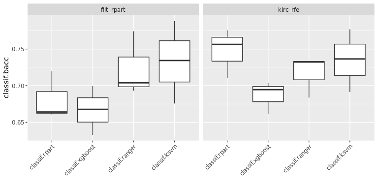
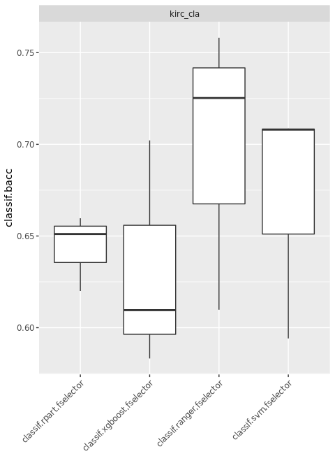

A Preprocessing analysis of clinical data of TCGA-KIRC patients and
building a model with mrl3
================

This project contains a pipeline for analysis of The Cancer Genome Atlas
Kidney - Renal Clear Cell Carcinoma (TCGA-KIRC) clinical data, from
[Genomic Data Commons Data Portal](https://portal.gdc.cancer.gov/).

# Intro

First of all we are going to load required packages and the data. The
data is part of the mlr3data package.

``` r
if(!require("mlr3")){install.packages("mlr3")}  # mlr3 base package

if(!require("mlr3learners")){install.packages("mlr3learners")}  # additional ML algorithms

if(!require("mlr3extralearners")){install.packages("mlr3extralearners")}  # extra ML algorithms

if(!require("mlr3pipelines")){install.packages("mlr3pipelines")} # create ML pipelines

if(!require("mlr3data")){install.packages("mlr3data")}  # another way to obtain data sets

if(!require("mlr3misc")){install.packages("mlr3misc")} # contains some helper functions

if(!require("mlr3tuning")){install.packages("mlr3tuning")} # tuning ML algorithms

if(!require("paradox")){install.packages("paradox")} # hyperparameter space

if(!require("mlr3viz")){install.packages("mlr3viz")}  # autoplot for benchmarks

if(!require("skimr")){install.packages("skimr")} # Compact and Flexible Summaries of Data

if(!require("finalfit")){install.packages("finalfit")} #  Quickly Create Elegant Regression Results Tables and Plots when Modelling

if(!require("tidyverse")){install.packages("tidyverse")} # R packages for data science

if(!require("bestNormalize")){install.packages("bestNormalize")} # Normalizing Transformation Functions 

if(!require("smotefamily")){install.packages("smotefamily")}  # SMOTE algorithm for imbalance correction

if(!require("VennDiagram")){install.packages("VennDiagram")}  # Generate High-Resolution Venn and Euler Plots
```

# Loading data

``` r
load("data/tcga_kirc.RData")
```

# Exploratory Data Analysis

We can use the skimr package in order to get a first overview of the
data:

``` r
## clinical data size : 
dim(kirc_cli)
```

    ## [1] 298  10

``` r
skimr::skim(kirc_cli)
```

|                                                  |           |
| :----------------------------------------------- | :-------- |
| Name                                             | kirc\_cli |
| Number of rows                                   | 298       |
| Number of columns                                | 10        |
| \_\_\_\_\_\_\_\_\_\_\_\_\_\_\_\_\_\_\_\_\_\_\_   |           |
| Column type frequency:                           |           |
| character                                        | 1         |
| factor                                           | 6         |
| numeric                                          | 3         |
| \_\_\_\_\_\_\_\_\_\_\_\_\_\_\_\_\_\_\_\_\_\_\_\_ |           |
| Group variables                                  | None      |

Data summary

**Variable type: character**

| skim\_variable | n\_missing | complete\_rate | min | max | empty | n\_unique | whitespace |
| :------------- | ---------: | -------------: | --: | --: | ----: | --------: | ---------: |
| patient\_id    |          0 |              1 |  12 |  12 |     0 |       298 |          0 |

**Variable type: factor**

| skim\_variable | n\_missing | complete\_rate | ordered | n\_unique | top\_counts                       |
| :------------- | ---------: | -------------: | :------ | --------: | :-------------------------------- |
| prior.dx       |          0 |           1.00 | FALSE   |         2 | no: 254, yes: 44                  |
| gender         |          0 |           1.00 | FALSE   |         2 | mal: 190, fem: 108                |
| race           |          0 |           1.00 | FALSE   |         4 | whi: 258, bla: 34, asi: 5, not: 1 |
| metastasis     |          2 |           0.99 | FALSE   |         3 | M0: 199, M1: 78, MX: 19           |
| neoplasm       |          0 |           1.00 | FALSE   |         3 | NX: 175, N0: 117, N1: 6           |
| ajcc.stage     |          0 |           1.00 | FALSE   |         4 | T1: 224, T3: 56, T2: 10, T4: 8    |

**Variable type: numeric**

| skim\_variable | n\_missing | complete\_rate |    mean |     sd | p0 |    p25 |    p50 |     p75 | p100 | hist  |
| :------------- | ---------: | -------------: | ------: | -----: | -: | -----: | -----: | ------: | ---: | :---- |
| age            |          0 |              1 |   58.54 |  11.77 | 26 |  50.25 |   59.0 |   66.75 |   86 | ▁▅▇▆▂ |
| status         |          0 |              1 |    0.21 |   0.41 |  0 |   0.00 |    0.0 |    0.00 |    1 | ▇▁▁▁▂ |
| obs.time       |          0 |              1 | 1338.14 | 998.08 |  3 | 476.25 | 1166.5 | 1954.25 | 4537 | ▇▆▃▂▁ |

Filtering rows only with M0 and M1.

``` r
kirc_cli <- kirc_cli %>% 
  dplyr::filter(metastasis %in% c("M0", "M1")) %>%
  droplevels()

skimr::skim(kirc_cli)
```

|                                                  |           |
| :----------------------------------------------- | :-------- |
| Name                                             | kirc\_cli |
| Number of rows                                   | 277       |
| Number of columns                                | 10        |
| \_\_\_\_\_\_\_\_\_\_\_\_\_\_\_\_\_\_\_\_\_\_\_   |           |
| Column type frequency:                           |           |
| character                                        | 1         |
| factor                                           | 6         |
| numeric                                          | 3         |
| \_\_\_\_\_\_\_\_\_\_\_\_\_\_\_\_\_\_\_\_\_\_\_\_ |           |
| Group variables                                  | None      |

Data summary

**Variable type: character**

| skim\_variable | n\_missing | complete\_rate | min | max | empty | n\_unique | whitespace |
| :------------- | ---------: | -------------: | --: | --: | ----: | --------: | ---------: |
| patient\_id    |          0 |              1 |  12 |  12 |     0 |       277 |          0 |

**Variable type: factor**

| skim\_variable | n\_missing | complete\_rate | ordered | n\_unique | top\_counts                       |
| :------------- | ---------: | -------------: | :------ | --------: | :-------------------------------- |
| prior.dx       |          0 |              1 | FALSE   |         2 | no: 235, yes: 42                  |
| gender         |          0 |              1 | FALSE   |         2 | mal: 182, fem: 95                 |
| race           |          0 |              1 | FALSE   |         4 | whi: 258, bla: 13, asi: 5, not: 1 |
| metastasis     |          0 |              1 | FALSE   |         2 | M0: 199, M1: 78                   |
| neoplasm       |          0 |              1 | FALSE   |         3 | NX: 155, N0: 116, N1: 6           |
| ajcc.stage     |          0 |              1 | FALSE   |         4 | T1: 203, T3: 56, T2: 10, T4: 8    |

**Variable type: numeric**

| skim\_variable | n\_missing | complete\_rate |    mean |     sd | p0 | p25 |  p50 |  p75 | p100 | hist  |
| :------------- | ---------: | -------------: | ------: | -----: | -: | --: | ---: | ---: | ---: | :---- |
| age            |          0 |              1 |   58.43 |  11.84 | 26 |  51 |   59 |   66 |   86 | ▁▅▇▆▂ |
| status         |          0 |              1 |    0.23 |   0.42 |  0 |   0 |    0 |    0 |    1 | ▇▁▁▁▂ |
| obs.time       |          0 |              1 | 1394.49 | 998.93 | 11 | 552 | 1257 | 1986 | 4537 | ▇▇▅▂▁ |

## Cleaning expression data and pre-selecting genes

``` r
dim(kirc_rna)
```

    ## [1]   301 58387

``` r
head(kirc_rna[, c(1:10)])
```

    ##                  TSPAN6 TNMD DPM1 SCYL3 C1orf112  FGR   CFH FUCA2 GCLC NFYA
    ## TCGA-A3-3387-01A   2261   17 1642   895      361 1903  6194  4448 2623 1952
    ## TCGA-BP-4769-01A   3101   56 1669   891      173  377  5319  3266 1531 1753
    ## TCGA-BP-4977-01A   5404  312 1471  1278      356 1041  3807  7086 3236 2131
    ## TCGA-B0-5080-01A   3808    8 1615   724      247  318 11994  3901 1095 1853
    ## TCGA-CZ-4862-01A   1955   12 1275   948      268 1255  3091  3829 2310 1529
    ## TCGA-BP-4758-01A   2099   43 1096   820      167 1244  2371  4092 1496 1630

``` r
# Check if there are duplicated gene symbols
colnames(kirc_rna)[duplicated(colnames(kirc_rna))]
```

    ## character(0)

We performed a differential expression analysis to select differentially
expressed genes, on script `job_differential_gene_expression.R`

We also selected a list with 252 genes of papers on genes signatures,
obtained from search of Pubmed with the keywords: `renal AND ‘gene
signature’ OR kidney AND ‘gene signature’`

We also selected all genes mapped from Kegg:

<https://www.genome.jp/dbget-bin/www_bget?path:map05211>

``` r
genes_DEA_M1 <- readLines("data/dea.M0.M1.lst")
genes_papers <- readLines("data/genes_papers.lst")
genes_kegg <- readLines("data/genes_kegg.lst")
```

Here, we selected top 50 features having the highest gene-wise variances
of genes\_papers and genes\_kegg in order to decrease computational
cost.

``` r
genes_id <- colnames(kirc_rna) %in% union(genes_papers, genes_kegg)
vars <- sort(apply(t(kirc_rna[, genes_id]), 1, var, na.rm = TRUE), decreasing = TRUE)[1:50]

genes <- union(genes_DEA_M1,names(vars))
genes_id <- colnames(kirc_rna) %in% genes
patients_id <-  rownames(kirc_rna) %in% rownames(kirc_cli)
  
kirc_rna <- kirc_rna[patients_id, genes_id] 

dim(kirc_rna)
```

    ## [1] 277 200

``` r
futile.logger::flog.threshold(futile.logger::ERROR, name = "VennDiagramLogger")
```

    ## NULL

``` r
venn.diagram(
  x = list(dea = genes_DEA_M1, papers = genes_papers, kegg = genes_kegg),
  cat.just=list(c(0.5,1) , c(2,-1) , c(-1,-22)),
  height = 1200, width = 1200,
  resolution = 200,
  filename = "figs/selected_features.png", 
  imagetype = "png",
  col = "black",
  fill = c("khaki1", "skyblue", "tomato3"),
  alpha = 0.50,
  lwd = 4,
  #cat.cex = 1.2,
  #cex = 1.5,
  cat.cex = 1,
  cex = 1,
  cat.fontface = "bold"
)
```

    ## [1] 1

``` r
knitr::include_graphics("figs/selected_features.png", dpi = NA)
```


Assertion on ‘feature names’: Must have names according to R’s variable
naming conventions.

``` r
# Rename columns, removing "-" 
colnames(kirc_rna) <- gsub("-", "_", colnames(kirc_rna))
# Minimum count is set to 1 in order to prevent 0 division problem within classification models.
kirc_rna <- (kirc_rna +1)
```

Selecting the data to classify metastasis

``` r
kirc_data <- as.data.frame(kirc_rna)
kirc_data$metastasis <- kirc_cli$metastasis
```

# A first model

Setting up the task and learner `rpart`: Recursive Partitioning and
Regression Trees

List of learners:
<https://mlr3extralearners.mlr-org.com/articles/learners/list_learners.html>

``` r
head(kirc_data[,c(1:4)])  %>% knitr::kable(.)
```

|                  | SLC4A1 | HHATL | SLC38A5 |  CD44 |
| :--------------- | -----: | ----: | ------: | ----: |
| TCGA-A3-3387-01A |      9 |     2 |      87 |  9706 |
| TCGA-BP-4769-01A |      9 |     5 |     759 | 23873 |
| TCGA-BP-4977-01A |   1025 |    32 |     101 |  7973 |
| TCGA-B0-5080-01A |      7 |     6 |    2799 | 18316 |
| TCGA-CZ-4862-01A |      9 |    12 |     358 |  9757 |
| TCGA-BP-4758-01A |     30 |    81 |     152 |  8484 |

``` r
tsk_raw <- TaskClassif$new(id="kirc_raw", 
                           backend = kirc_data, 
                           target = "metastasis", 
                           positive = "M1")

p_bc = po("boxcox", 
          affect_columns = selector_type("numeric"))

kirc_norm = p_bc$train(list(tsk_raw))$output$data()

head(kirc_norm[,c(1:4)])  %>% knitr::kable(.)
```

| metastasis |  AC003092.1 |  AC006262.4 |  AC006262.5 |
| :--------- | ----------: | ----------: | ----------: |
| M0         |   1.0007861 |   0.9466137 |   0.6634673 |
| M0         | \-0.4147400 | \-1.1683487 |   0.7720185 |
| M0         |   0.4485704 | \-0.2441639 | \-1.2650111 |
| M1         |   0.9271871 |   1.8700639 |   1.9415030 |
| M0         |   1.2527336 |   0.8604927 |   0.0801742 |
| M0         | \-0.4147400 | \-1.1683487 | \-1.2650111 |

``` r
tsk_cla <- TaskClassif$new(id="kirc_cla", 
                           backend = kirc_norm, 
                           target = "metastasis", 
                           positive = "M1")


tsk_cla
```

    ## <TaskClassif:kirc_cla> (277 x 201)
    ## * Target: metastasis
    ## * Properties: twoclass
    ## * Features (200):
    ##   - dbl (200): AC003092.1, AC006262.4, AC006262.5, AC007879.6,
    ##     AC104654.2, AC116614.1, AFM, AHSG, AMH, ANGPTL4, APCDD1L_AS1,
    ##     APOLD1, AQP2, AQP6, ATP6V0A4, ATP6V0D2, BARX1, BSND, C10orf99,
    ##     C14orf180, CA1, CASP14, CCNA1, CD34, CD44, CDC42P2, CDKN1A, CHAT,
    ##     CIDEC, CILP2, CITF22_24E5.1, CLCNKB, CLDN8, CLMP, COL11A1, COL7A1,
    ##     CPNE7, CSF1R, CTD_2008P7.9, CXCL13, CXCL9, CYP1A1, DMRT2, DQX1,
    ##     EDNRB, EN2, EPAS1, ESM1, ESRP1, ETS1, FAM83B, FDCSP, FGF5, FKBP9P1,
    ##     FLT1, FOXI2, FXYD4, GGT6, GJA1, GLB1L3, GNAS, GOLGA6L2, GOLGA6L7P,
    ##     GPR110, HAVCR2, HEPACAM2, HHATL, HIF1A, HLA_DRA, HMGA2, HS3ST3A1,
    ##     IGF2BP3, IGFBP1, IGFL1P1, IGFN1, IGHV1_69, IGKV3_11, IGLC7,
    ##     IGLV3_19, INHBE, ITPKA, JUN, KCNJ1, KDR, KIRREL3, KLF17, KLK1,
    ##     KLK15, KNG1, KRT7, KTN1, L1CAM, LCP1, LECT1, LINC00890, LINC00942,
    ##     LINC00973, LINC01187, LINC01436, LINC01559, [...]

## Train and Predict

Setting up the train/test splits of the data

``` r
set.seed(1)
train_set = sample(tsk_cla$nrow,  0.7 * tsk_cla$nrow)

test_set = setdiff(seq_len(tsk_cla$nrow), train_set)
```

The field `$model` stores the model that is produced in the training
step. Before the `$train()` method is called on a learner object, this
field is `NULL`:

``` r
learner = lrn("classif.rpart")
learner$model
```

    ## NULL

Next, the classification tree is trained using the train set of the task
by calling the $train() method of the Learner:

``` r
set.seed(1)

learner$train(tsk_cla, row_ids = train_set)

print(learner$model)
```

    ## n= 193 
    ## 
    ## node), split, n, loss, yval, (yprob)
    ##       * denotes terminal node
    ## 
    ##  1) root 193 52 M0 (0.26943005 0.73056995)  
    ##    2) TNNT1>=0.7619996 46 16 M1 (0.65217391 0.34782609)  
    ##      4) PODXL< -0.1714606 33  5 M1 (0.84848485 0.15151515)  
    ##        8) MUC1< 0.8321847 26  1 M1 (0.96153846 0.03846154) *
    ##        9) MUC1>=0.8321847 7  3 M0 (0.42857143 0.57142857) *
    ##      5) PODXL>=-0.1714606 13  2 M0 (0.15384615 0.84615385) *
    ##    3) TNNT1< 0.7619996 147 22 M0 (0.14965986 0.85034014)  
    ##      6) CHAT>=1.561052 11  4 M1 (0.63636364 0.36363636) *
    ##      7) CHAT< 1.561052 136 15 M0 (0.11029412 0.88970588)  
    ##       14) C10orf99>=1.343281 9  4 M1 (0.55555556 0.44444444) *
    ##       15) C10orf99< 1.343281 127 10 M0 (0.07874016 0.92125984) *

## Predicting

``` r
prediction = learner$predict(tsk_cla, row_ids = test_set)
prediction$confusion
```

    ##         truth
    ## response M1 M0
    ##       M1  9  9
    ##       M0 17 49

``` r
prediction$score( msr("classif.acc"))
```

    ## classif.acc 
    ##   0.6904762

## Evaluating with distincs measures

`View(as.data.table(mlr_measures))`

``` r
measures = list(
  msr("classif.acc"), 
  msr("classif.bacc"),
  msr("classif.precision"),
  msr("classif.sensitivity"), 
  msr("classif.specificity")
  )

prediction$score(measures)
```

    ##         classif.acc        classif.bacc   classif.precision classif.sensitivity 
    ##           0.6904762           0.5954907           0.5000000           0.3461538 
    ## classif.specificity 
    ##           0.8448276

## Resampling

Setting up our resampling method

``` r
rsmp_cv = rsmp("cv", folds = 3L)$instantiate(tsk_cla)

res = resample(task = tsk_cla, 
               learner = learner, 
               resampling = rsmp_cv,
               store_models = TRUE)

measures <- list(
  msr("classif.acc"),
  msr("classif.bacc"),
  msr("classif.precision"), 
  msr("classif.sensitivity"), 
  msr("classif.specificity")
)

agg <- res$aggregate(measures)

agg
```

    ##         classif.acc        classif.bacc   classif.precision classif.sensitivity 
    ##           0.7363643           0.6374412           0.6148148           0.4031899 
    ## classif.specificity 
    ##           0.8716925

# Filter Selection - Variable Importance Filters

``` r
tsk_filt <- TaskClassif$new(id="filt_rpart", 
                               backend = kirc_norm, 
                               target = "metastasis", 
                               positive = "M1")


lrn = lrn("classif.rpart")

library("mlr3filters")
filter = flt("importance", learner = lrn)

filter$calculate(tsk_filt)

head(as.data.table(filter), 20)  %>% knitr::kable(.)
```

| feature        |     score |
| :------------- | --------: |
| ITPKA          | 25.850198 |
| CXCL9          | 12.417847 |
| CLMP           | 11.960240 |
| TNNT1          |  9.542290 |
| INHBE          |  9.339377 |
| ZIC2           |  9.200185 |
| RP11\_400N13.3 |  8.836364 |
| COL7A1         |  7.360148 |
| KLF17          |  7.360148 |
| GLB1L3         |  6.319971 |
| EN2            |  5.553346 |
| SLC2A1         |  5.301818 |
| AC003092.1     |  5.301818 |
| L1CAM          |  5.301818 |
| CD44           |  4.418182 |
| C10orf99       |  4.418182 |
| IGF2BP3        |  3.640505 |
| LCP1           |  3.449402 |
| IGKV3\_11      |  2.759521 |
| RP11\_95M15.2  |  2.759521 |

``` r
cols <- head(as.data.table(filter), 20)$feature

tsk_filt$select(cols = cols)
```

# Feature selection - RFE

``` r
library(mlr3fselect)

tsk_rfe <- TaskClassif$new(id="rfe_part", 
                               backend = kirc_norm, 
                               target = "metastasis", 
                               positive = "M1")


terminator = trm("evals", n_evals = 100)

instance = FSelectInstanceSingleCrit$new(
  task = tsk_rfe,
  learner = lrn("classif.rpart"),
  resampling = rsmp("cv", folds = 5),
  measure = msr("classif.bacc"),
  terminator = terminator,
  store_models = T
)

# Modifies the instance by reference ----
fselector = fs("rfe", min_features=10)
#fselector$optimize(instance)  
```

``` r
print(instance$result_y)
```

    ## classif.bacc 
    ##    0.6934761

``` r
tsk_rfe <- TaskClassif$new(id="kirc_rfe", 
                               backend = kirc_norm, 
                               target = "metastasis", 
                               positive = "M1")


tsk_rfe$select(cols = instance$result_feature_set)
tsk_rfe
```

    ## <TaskClassif:kirc_rfe> (277 x 13)
    ## * Target: metastasis
    ## * Properties: twoclass
    ## * Features (12):
    ##   - dbl (12): APOLD1, CLMP, EPAS1, ETS1, FLT1, INHBE, ITPKA, KDR,
    ##     PODXL, PTPRB, TNNT1, ZIC2

``` r
lrn.rpa = lrn("classif.rpart")
lrn.xgb = lrn("classif.xgboost")
lrn.rgn = lrn("classif.ranger")
lrn.svm = lrn("classif.ksvm")

grid = benchmark_grid(
  task = list(tsk_filt, tsk_rfe),
  learner = list(lrn.rpa, lrn.xgb, lrn.rgn, lrn.svm),
  resampling = rsmp("cv", folds = 3)
)

#bmr = benchmark(grid, store_models = TRUE)
```

``` r
cols <- c("task_id", "learner_id",  "classif.bacc", "classif.sensitivity", "classif.specificity")

measures <- list(
  msr("classif.bacc"),
  msr("classif.sensitivity"), 
  msr("classif.specificity")
)

bmr_df <- bmr$aggregate(measures) %>%
  dplyr::select(cols) %>%
  dplyr::arrange(desc(classif.bacc))
```

    ## Note: Using an external vector in selections is ambiguous.
    ## ℹ Use `all_of(cols)` instead of `cols` to silence this message.
    ## ℹ See <https://tidyselect.r-lib.org/reference/faq-external-vector.html>.
    ## This message is displayed once per session.

``` r
bmr_df  %>% knitr::kable(.)
```

| task\_id    | learner\_id     | classif.bacc | classif.sensitivity | classif.specificity |
| :---------- | :-------------- | -----------: | ------------------: | ------------------: |
| kirc\_rfe   | classif.rpart   |    0.7475278 |           0.5910494 |           0.9040061 |
| kirc\_rfe   | classif.ksvm    |    0.7349819 |           0.5154321 |           0.9545317 |
| filt\_rpart | classif.ksvm    |    0.7328062 |           0.5109469 |           0.9546655 |
| filt\_rpart | classif.ranger  |    0.7237754 |           0.5335249 |           0.9140258 |
| kirc\_rfe   | classif.ranger  |    0.7167175 |           0.5138889 |           0.9195461 |
| kirc\_rfe   | classif.xgboost |    0.6865448 |           0.5030864 |           0.8700032 |
| filt\_rpart | classif.rpart   |    0.6815068 |           0.5552819 |           0.8077318 |
| filt\_rpart | classif.xgboost |    0.6666129 |           0.5207991 |           0.8124266 |

# Plotting Benchmark Results

``` r
library("mlr3viz")
library("ggplot2")

autoplot(bmr, measure= msr("classif.bacc")) + 
  theme(axis.text.x = element_text(angle = 45, hjust = 1))
```

<!-- -->

# Automating the Feature Selection

``` r
library("paradox")
library("mlr3fselect")
library("mlr3extralearners")

terminator = trm("evals", n_evals = 20)
fselector = fs("random_search")

lrn.rpa = lrn("classif.rpart")
lrn.xgb = lrn("classif.xgboost")
lrn.ranger = lrn("classif.ranger")
lrn.svm = lrn("classif.svm")


at.rpa = AutoFSelector$new(
  learner = lrn.rpa,
  resampling = rsmp("holdout"),
  measure = msr("classif.bacc"),
  terminator = terminator,
  fselector = fselector
)

at.xgb = AutoFSelector$new(
  learner = lrn.xgb,
  resampling = rsmp("holdout"),
  measure = msr("classif.bacc"),
  terminator = terminator,
  fselector = fselector
)

at.ranger = AutoFSelector$new(
  learner = lrn.ranger,
  resampling = rsmp("holdout"),
  measure = msr("classif.bacc"),
  terminator = terminator,
  fselector = fselector
)

at.svm = AutoFSelector$new(
  learner = lrn.svm,
  resampling = rsmp("holdout"),
  measure = msr("classif.bacc"),
  terminator = terminator,
  fselector = fselector
)
```

``` r
tsk_cla <- TaskClassif$new(id="kirc_cla", 
                               backend = kirc_norm, 
                               target = "metastasis", 
                               positive = "M1")


grid = benchmark_grid(
  task = tsk_cla,
  learner = list(at.rpa, at.xgb, at.ranger, at.svm),
  resampling = rsmp("cv", folds = 3)
)
```

``` r
bmr = benchmark(grid, store_models = TRUE)
```

    ## [18:33:25] WARNING: amalgamation/../src/learner.cc:1061: Starting in XGBoost 1.3.0, the default evaluation metric used with the objective 'binary:logistic' was changed from 'error' to 'logloss'. Explicitly set eval_metric if you'd like to restore the old behavior.
    ## [18:33:25] WARNING: amalgamation/../src/learner.cc:1061: Starting in XGBoost 1.3.0, the default evaluation metric used with the objective 'binary:logistic' was changed from 'error' to 'logloss'. Explicitly set eval_metric if you'd like to restore the old behavior.
    ## [18:33:25] WARNING: amalgamation/../src/learner.cc:1061: Starting in XGBoost 1.3.0, the default evaluation metric used with the objective 'binary:logistic' was changed from 'error' to 'logloss'. Explicitly set eval_metric if you'd like to restore the old behavior.
    ## [18:33:25] WARNING: amalgamation/../src/learner.cc:1061: Starting in XGBoost 1.3.0, the default evaluation metric used with the objective 'binary:logistic' was changed from 'error' to 'logloss'. Explicitly set eval_metric if you'd like to restore the old behavior.
    ## [18:33:25] WARNING: amalgamation/../src/learner.cc:1061: Starting in XGBoost 1.3.0, the default evaluation metric used with the objective 'binary:logistic' was changed from 'error' to 'logloss'. Explicitly set eval_metric if you'd like to restore the old behavior.
    ## [18:33:25] WARNING: amalgamation/../src/learner.cc:1061: Starting in XGBoost 1.3.0, the default evaluation metric used with the objective 'binary:logistic' was changed from 'error' to 'logloss'. Explicitly set eval_metric if you'd like to restore the old behavior.
    ## [18:33:25] WARNING: amalgamation/../src/learner.cc:1061: Starting in XGBoost 1.3.0, the default evaluation metric used with the objective 'binary:logistic' was changed from 'error' to 'logloss'. Explicitly set eval_metric if you'd like to restore the old behavior.
    ## [18:33:25] WARNING: amalgamation/../src/learner.cc:1061: Starting in XGBoost 1.3.0, the default evaluation metric used with the objective 'binary:logistic' was changed from 'error' to 'logloss'. Explicitly set eval_metric if you'd like to restore the old behavior.
    ## [18:33:25] WARNING: amalgamation/../src/learner.cc:1061: Starting in XGBoost 1.3.0, the default evaluation metric used with the objective 'binary:logistic' was changed from 'error' to 'logloss'. Explicitly set eval_metric if you'd like to restore the old behavior.
    ## [18:33:25] WARNING: amalgamation/../src/learner.cc:1061: Starting in XGBoost 1.3.0, the default evaluation metric used with the objective 'binary:logistic' was changed from 'error' to 'logloss'. Explicitly set eval_metric if you'd like to restore the old behavior.
    ## [18:33:27] WARNING: amalgamation/../src/learner.cc:1061: Starting in XGBoost 1.3.0, the default evaluation metric used with the objective 'binary:logistic' was changed from 'error' to 'logloss'. Explicitly set eval_metric if you'd like to restore the old behavior.
    ## [18:33:27] WARNING: amalgamation/../src/learner.cc:1061: Starting in XGBoost 1.3.0, the default evaluation metric used with the objective 'binary:logistic' was changed from 'error' to 'logloss'. Explicitly set eval_metric if you'd like to restore the old behavior.
    ## [18:33:27] WARNING: amalgamation/../src/learner.cc:1061: Starting in XGBoost 1.3.0, the default evaluation metric used with the objective 'binary:logistic' was changed from 'error' to 'logloss'. Explicitly set eval_metric if you'd like to restore the old behavior.
    ## [18:33:27] WARNING: amalgamation/../src/learner.cc:1061: Starting in XGBoost 1.3.0, the default evaluation metric used with the objective 'binary:logistic' was changed from 'error' to 'logloss'. Explicitly set eval_metric if you'd like to restore the old behavior.
    ## [18:33:27] WARNING: amalgamation/../src/learner.cc:1061: Starting in XGBoost 1.3.0, the default evaluation metric used with the objective 'binary:logistic' was changed from 'error' to 'logloss'. Explicitly set eval_metric if you'd like to restore the old behavior.
    ## [18:33:27] WARNING: amalgamation/../src/learner.cc:1061: Starting in XGBoost 1.3.0, the default evaluation metric used with the objective 'binary:logistic' was changed from 'error' to 'logloss'. Explicitly set eval_metric if you'd like to restore the old behavior.
    ## [18:33:27] WARNING: amalgamation/../src/learner.cc:1061: Starting in XGBoost 1.3.0, the default evaluation metric used with the objective 'binary:logistic' was changed from 'error' to 'logloss'. Explicitly set eval_metric if you'd like to restore the old behavior.
    ## [18:33:28] WARNING: amalgamation/../src/learner.cc:1061: Starting in XGBoost 1.3.0, the default evaluation metric used with the objective 'binary:logistic' was changed from 'error' to 'logloss'. Explicitly set eval_metric if you'd like to restore the old behavior.
    ## [18:33:28] WARNING: amalgamation/../src/learner.cc:1061: Starting in XGBoost 1.3.0, the default evaluation metric used with the objective 'binary:logistic' was changed from 'error' to 'logloss'. Explicitly set eval_metric if you'd like to restore the old behavior.
    ## [18:33:28] WARNING: amalgamation/../src/learner.cc:1061: Starting in XGBoost 1.3.0, the default evaluation metric used with the objective 'binary:logistic' was changed from 'error' to 'logloss'. Explicitly set eval_metric if you'd like to restore the old behavior.
    ## [18:33:28] WARNING: amalgamation/../src/learner.cc:1061: Starting in XGBoost 1.3.0, the default evaluation metric used with the objective 'binary:logistic' was changed from 'error' to 'logloss'. Explicitly set eval_metric if you'd like to restore the old behavior.
    ## [18:33:39] WARNING: amalgamation/../src/learner.cc:1061: Starting in XGBoost 1.3.0, the default evaluation metric used with the objective 'binary:logistic' was changed from 'error' to 'logloss'. Explicitly set eval_metric if you'd like to restore the old behavior.
    ## [18:33:39] WARNING: amalgamation/../src/learner.cc:1061: Starting in XGBoost 1.3.0, the default evaluation metric used with the objective 'binary:logistic' was changed from 'error' to 'logloss'. Explicitly set eval_metric if you'd like to restore the old behavior.
    ## [18:33:39] WARNING: amalgamation/../src/learner.cc:1061: Starting in XGBoost 1.3.0, the default evaluation metric used with the objective 'binary:logistic' was changed from 'error' to 'logloss'. Explicitly set eval_metric if you'd like to restore the old behavior.
    ## [18:33:39] WARNING: amalgamation/../src/learner.cc:1061: Starting in XGBoost 1.3.0, the default evaluation metric used with the objective 'binary:logistic' was changed from 'error' to 'logloss'. Explicitly set eval_metric if you'd like to restore the old behavior.
    ## [18:33:39] WARNING: amalgamation/../src/learner.cc:1061: Starting in XGBoost 1.3.0, the default evaluation metric used with the objective 'binary:logistic' was changed from 'error' to 'logloss'. Explicitly set eval_metric if you'd like to restore the old behavior.
    ## [18:33:39] WARNING: amalgamation/../src/learner.cc:1061: Starting in XGBoost 1.3.0, the default evaluation metric used with the objective 'binary:logistic' was changed from 'error' to 'logloss'. Explicitly set eval_metric if you'd like to restore the old behavior.
    ## [18:33:39] WARNING: amalgamation/../src/learner.cc:1061: Starting in XGBoost 1.3.0, the default evaluation metric used with the objective 'binary:logistic' was changed from 'error' to 'logloss'. Explicitly set eval_metric if you'd like to restore the old behavior.
    ## [18:33:39] WARNING: amalgamation/../src/learner.cc:1061: Starting in XGBoost 1.3.0, the default evaluation metric used with the objective 'binary:logistic' was changed from 'error' to 'logloss'. Explicitly set eval_metric if you'd like to restore the old behavior.
    ## [18:33:39] WARNING: amalgamation/../src/learner.cc:1061: Starting in XGBoost 1.3.0, the default evaluation metric used with the objective 'binary:logistic' was changed from 'error' to 'logloss'. Explicitly set eval_metric if you'd like to restore the old behavior.
    ## [18:33:39] WARNING: amalgamation/../src/learner.cc:1061: Starting in XGBoost 1.3.0, the default evaluation metric used with the objective 'binary:logistic' was changed from 'error' to 'logloss'. Explicitly set eval_metric if you'd like to restore the old behavior.
    ## [18:33:42] WARNING: amalgamation/../src/learner.cc:1061: Starting in XGBoost 1.3.0, the default evaluation metric used with the objective 'binary:logistic' was changed from 'error' to 'logloss'. Explicitly set eval_metric if you'd like to restore the old behavior.
    ## [18:33:42] WARNING: amalgamation/../src/learner.cc:1061: Starting in XGBoost 1.3.0, the default evaluation metric used with the objective 'binary:logistic' was changed from 'error' to 'logloss'. Explicitly set eval_metric if you'd like to restore the old behavior.
    ## [18:33:42] WARNING: amalgamation/../src/learner.cc:1061: Starting in XGBoost 1.3.0, the default evaluation metric used with the objective 'binary:logistic' was changed from 'error' to 'logloss'. Explicitly set eval_metric if you'd like to restore the old behavior.
    ## [18:33:42] WARNING: amalgamation/../src/learner.cc:1061: Starting in XGBoost 1.3.0, the default evaluation metric used with the objective 'binary:logistic' was changed from 'error' to 'logloss'. Explicitly set eval_metric if you'd like to restore the old behavior.
    ## [18:33:42] WARNING: amalgamation/../src/learner.cc:1061: Starting in XGBoost 1.3.0, the default evaluation metric used with the objective 'binary:logistic' was changed from 'error' to 'logloss'. Explicitly set eval_metric if you'd like to restore the old behavior.
    ## [18:33:42] WARNING: amalgamation/../src/learner.cc:1061: Starting in XGBoost 1.3.0, the default evaluation metric used with the objective 'binary:logistic' was changed from 'error' to 'logloss'. Explicitly set eval_metric if you'd like to restore the old behavior.
    ## [18:33:43] WARNING: amalgamation/../src/learner.cc:1061: Starting in XGBoost 1.3.0, the default evaluation metric used with the objective 'binary:logistic' was changed from 'error' to 'logloss'. Explicitly set eval_metric if you'd like to restore the old behavior.
    ## [18:33:43] WARNING: amalgamation/../src/learner.cc:1061: Starting in XGBoost 1.3.0, the default evaluation metric used with the objective 'binary:logistic' was changed from 'error' to 'logloss'. Explicitly set eval_metric if you'd like to restore the old behavior.
    ## [18:33:43] WARNING: amalgamation/../src/learner.cc:1061: Starting in XGBoost 1.3.0, the default evaluation metric used with the objective 'binary:logistic' was changed from 'error' to 'logloss'. Explicitly set eval_metric if you'd like to restore the old behavior.
    ## [18:33:43] WARNING: amalgamation/../src/learner.cc:1061: Starting in XGBoost 1.3.0, the default evaluation metric used with the objective 'binary:logistic' was changed from 'error' to 'logloss'. Explicitly set eval_metric if you'd like to restore the old behavior.
    ## [18:33:44] WARNING: amalgamation/../src/learner.cc:1061: Starting in XGBoost 1.3.0, the default evaluation metric used with the objective 'binary:logistic' was changed from 'error' to 'logloss'. Explicitly set eval_metric if you'd like to restore the old behavior.
    ## [18:33:59] WARNING: amalgamation/../src/learner.cc:1061: Starting in XGBoost 1.3.0, the default evaluation metric used with the objective 'binary:logistic' was changed from 'error' to 'logloss'. Explicitly set eval_metric if you'd like to restore the old behavior.
    ## [18:33:59] WARNING: amalgamation/../src/learner.cc:1061: Starting in XGBoost 1.3.0, the default evaluation metric used with the objective 'binary:logistic' was changed from 'error' to 'logloss'. Explicitly set eval_metric if you'd like to restore the old behavior.
    ## [18:33:59] WARNING: amalgamation/../src/learner.cc:1061: Starting in XGBoost 1.3.0, the default evaluation metric used with the objective 'binary:logistic' was changed from 'error' to 'logloss'. Explicitly set eval_metric if you'd like to restore the old behavior.
    ## [18:33:59] WARNING: amalgamation/../src/learner.cc:1061: Starting in XGBoost 1.3.0, the default evaluation metric used with the objective 'binary:logistic' was changed from 'error' to 'logloss'. Explicitly set eval_metric if you'd like to restore the old behavior.
    ## [18:33:59] WARNING: amalgamation/../src/learner.cc:1061: Starting in XGBoost 1.3.0, the default evaluation metric used with the objective 'binary:logistic' was changed from 'error' to 'logloss'. Explicitly set eval_metric if you'd like to restore the old behavior.
    ## [18:33:59] WARNING: amalgamation/../src/learner.cc:1061: Starting in XGBoost 1.3.0, the default evaluation metric used with the objective 'binary:logistic' was changed from 'error' to 'logloss'. Explicitly set eval_metric if you'd like to restore the old behavior.
    ## [18:33:59] WARNING: amalgamation/../src/learner.cc:1061: Starting in XGBoost 1.3.0, the default evaluation metric used with the objective 'binary:logistic' was changed from 'error' to 'logloss'. Explicitly set eval_metric if you'd like to restore the old behavior.
    ## [18:33:59] WARNING: amalgamation/../src/learner.cc:1061: Starting in XGBoost 1.3.0, the default evaluation metric used with the objective 'binary:logistic' was changed from 'error' to 'logloss'. Explicitly set eval_metric if you'd like to restore the old behavior.
    ## [18:33:59] WARNING: amalgamation/../src/learner.cc:1061: Starting in XGBoost 1.3.0, the default evaluation metric used with the objective 'binary:logistic' was changed from 'error' to 'logloss'. Explicitly set eval_metric if you'd like to restore the old behavior.
    ## [18:34:00] WARNING: amalgamation/../src/learner.cc:1061: Starting in XGBoost 1.3.0, the default evaluation metric used with the objective 'binary:logistic' was changed from 'error' to 'logloss'. Explicitly set eval_metric if you'd like to restore the old behavior.
    ## [18:34:01] WARNING: amalgamation/../src/learner.cc:1061: Starting in XGBoost 1.3.0, the default evaluation metric used with the objective 'binary:logistic' was changed from 'error' to 'logloss'. Explicitly set eval_metric if you'd like to restore the old behavior.
    ## [18:34:01] WARNING: amalgamation/../src/learner.cc:1061: Starting in XGBoost 1.3.0, the default evaluation metric used with the objective 'binary:logistic' was changed from 'error' to 'logloss'. Explicitly set eval_metric if you'd like to restore the old behavior.
    ## [18:34:01] WARNING: amalgamation/../src/learner.cc:1061: Starting in XGBoost 1.3.0, the default evaluation metric used with the objective 'binary:logistic' was changed from 'error' to 'logloss'. Explicitly set eval_metric if you'd like to restore the old behavior.
    ## [18:34:02] WARNING: amalgamation/../src/learner.cc:1061: Starting in XGBoost 1.3.0, the default evaluation metric used with the objective 'binary:logistic' was changed from 'error' to 'logloss'. Explicitly set eval_metric if you'd like to restore the old behavior.
    ## [18:34:02] WARNING: amalgamation/../src/learner.cc:1061: Starting in XGBoost 1.3.0, the default evaluation metric used with the objective 'binary:logistic' was changed from 'error' to 'logloss'. Explicitly set eval_metric if you'd like to restore the old behavior.
    ## [18:34:02] WARNING: amalgamation/../src/learner.cc:1061: Starting in XGBoost 1.3.0, the default evaluation metric used with the objective 'binary:logistic' was changed from 'error' to 'logloss'. Explicitly set eval_metric if you'd like to restore the old behavior.
    ## [18:34:02] WARNING: amalgamation/../src/learner.cc:1061: Starting in XGBoost 1.3.0, the default evaluation metric used with the objective 'binary:logistic' was changed from 'error' to 'logloss'. Explicitly set eval_metric if you'd like to restore the old behavior.
    ## [18:34:02] WARNING: amalgamation/../src/learner.cc:1061: Starting in XGBoost 1.3.0, the default evaluation metric used with the objective 'binary:logistic' was changed from 'error' to 'logloss'. Explicitly set eval_metric if you'd like to restore the old behavior.
    ## [18:34:02] WARNING: amalgamation/../src/learner.cc:1061: Starting in XGBoost 1.3.0, the default evaluation metric used with the objective 'binary:logistic' was changed from 'error' to 'logloss'. Explicitly set eval_metric if you'd like to restore the old behavior.
    ## [18:34:02] WARNING: amalgamation/../src/learner.cc:1061: Starting in XGBoost 1.3.0, the default evaluation metric used with the objective 'binary:logistic' was changed from 'error' to 'logloss'. Explicitly set eval_metric if you'd like to restore the old behavior.
    ## [18:34:03] WARNING: amalgamation/../src/learner.cc:1061: Starting in XGBoost 1.3.0, the default evaluation metric used with the objective 'binary:logistic' was changed from 'error' to 'logloss'. Explicitly set eval_metric if you'd like to restore the old behavior.

``` r
cols <- c("task_id", "learner_id",  "classif.bacc", "classif.sensitivity", "classif.specificity")

measures <- list(
  msr("classif.bacc"),
  msr("classif.sensitivity"), 
  msr("classif.specificity")
)

bmr_df <- bmr$aggregate(measures) %>%
  dplyr::select(cols) %>%
  dplyr::arrange(desc(classif.bacc))

bmr_df  %>% knitr::kable(.)
```

| task\_id  | learner\_id               | classif.bacc | classif.sensitivity | classif.specificity |
| :-------- | :------------------------ | -----------: | ------------------: | ------------------: |
| kirc\_cla | classif.ranger.fselector  |    0.6977408 |           0.4539239 |           0.9415578 |
| kirc\_cla | classif.svm.fselector     |    0.6702514 |           0.3891997 |           0.9513031 |
| kirc\_cla | classif.rpart.fselector   |    0.6435958 |           0.4508936 |           0.8362980 |
| kirc\_cla | classif.xgboost.fselector |    0.6316448 |           0.4528361 |           0.8104535 |

# Plotting Benchmark Results

``` r
library("mlr3viz")
library("ggplot2")

autoplot(bmr, measure= msr("classif.bacc")) + 
  theme(axis.text.x = element_text(angle = 45, hjust = 1))
```

<!-- -->
