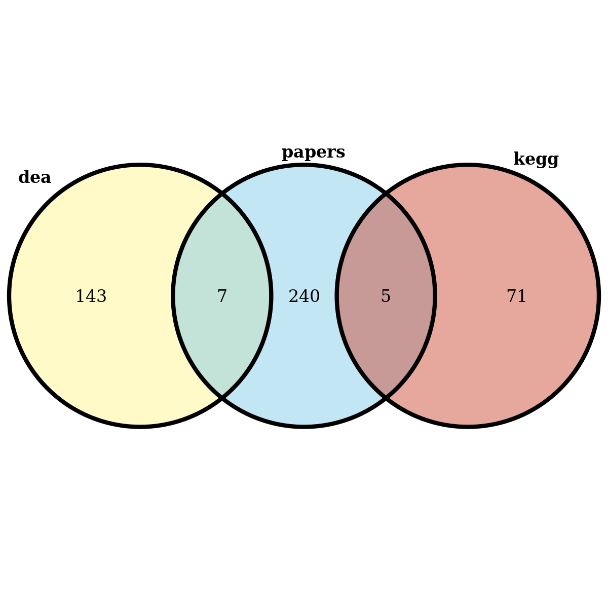

A Preprocessing analysis of clinical data of TCGA-KIRC patients and
building a model with mrl3
================

This project contains a pipeline for analysis of The Cancer Genome Atlas
Kidney - Renal Clear Cell Carcinoma (TCGA-KIRC) clinical data, from
[Genomic Data Commons Data Portal](https://portal.gdc.cancer.gov/).

``` r
# Avoid duplicate label error of knitr::purl

options(knitr.duplicate.label = 'allow')
# Code to browse the markdown file with renderized images.
knitr::opts_chunk$set(
  fig.path = "figs/tutorial_"
)
```

# Intro

First of all we are going to load required packages and the data. The
data is part of the mlr3data package.

``` r
if(!require("mlr3")){install.packages("mlr3")}  # mlr3 base package

if(!require("mlr3learners")){install.packages("mlr3learners")}  # additional ML algorithms

if(!require("mlr3extralearners")){install.packages("mlr3extralearners")}  # extra ML algorithms

if(!require("mlr3pipelines")){install.packages("mlr3pipelines")} # create ML pipelines

if(!require("mlr3data")){install.packages("mlr3data")}  # another way to obtain data sets

if(!require("mlr3misc")){install.packages("mlr3misc")} # contains some helper functions

if(!require("mlr3tuning")){install.packages("mlr3tuning")} # tuning ML algorithms

if(!require("paradox")){install.packages("paradox")} # hyperparameter space

if(!require("mlr3viz")){install.packages("mlr3viz")}  # autoplot for benchmarks

if(!require("skimr")){install.packages("skimr")} # Compact and Flexible Summaries of Data

if(!require("finalfit")){install.packages("finalfit")} #  Quickly Create Elegant Regression Results Tables and Plots when Modelling

if(!require("tidyverse")){install.packages("tidyverse")} # R packages for data science

if(!require("bestNormalize")){install.packages("bestNormalize")} # Normalizing Transformation Functions 

if(!require("smotefamily")){install.packages("smotefamily")}  # SMOTE algorithm for imbalance correction

if(!require("VennDiagram")){install.packages("VennDiagram")}  # Generate High-Resolution Venn and Euler Plots
```

# Loading data

``` r
load("data/tcga_kirc.RData")
```

# Exploratory Data Analysis

We can use the skimr package in order to get a first overview of the
data:

``` r
## clinical data size : 
dim(kirc_cli)
```

    ## [1] 298  10

``` r
skimr::skim(kirc_cli)
```

|                                                  |           |
| :----------------------------------------------- | :-------- |
| Name                                             | kirc\_cli |
| Number of rows                                   | 298       |
| Number of columns                                | 10        |
| \_\_\_\_\_\_\_\_\_\_\_\_\_\_\_\_\_\_\_\_\_\_\_   |           |
| Column type frequency:                           |           |
| character                                        | 1         |
| factor                                           | 6         |
| numeric                                          | 3         |
| \_\_\_\_\_\_\_\_\_\_\_\_\_\_\_\_\_\_\_\_\_\_\_\_ |           |
| Group variables                                  | None      |

Data summary

**Variable type: character**

| skim\_variable | n\_missing | complete\_rate | min | max | empty | n\_unique | whitespace |
| :------------- | ---------: | -------------: | --: | --: | ----: | --------: | ---------: |
| patient\_id    |          0 |              1 |  12 |  12 |     0 |       298 |          0 |

**Variable type: factor**

| skim\_variable | n\_missing | complete\_rate | ordered | n\_unique | top\_counts                       |
| :------------- | ---------: | -------------: | :------ | --------: | :-------------------------------- |
| prior.dx       |          0 |           1.00 | FALSE   |         2 | no: 254, yes: 44                  |
| gender         |          0 |           1.00 | FALSE   |         2 | mal: 190, fem: 108                |
| race           |          0 |           1.00 | FALSE   |         4 | whi: 258, bla: 34, asi: 5, not: 1 |
| metastasis     |          2 |           0.99 | FALSE   |         3 | M0: 199, M1: 78, MX: 19           |
| neoplasm       |          0 |           1.00 | FALSE   |         3 | NX: 175, N0: 117, N1: 6           |
| ajcc.stage     |          0 |           1.00 | FALSE   |         4 | T1: 224, T3: 56, T2: 10, T4: 8    |

**Variable type: numeric**

| skim\_variable | n\_missing | complete\_rate |    mean |     sd | p0 |    p25 |    p50 |     p75 | p100 | hist  |
| :------------- | ---------: | -------------: | ------: | -----: | -: | -----: | -----: | ------: | ---: | :---- |
| age            |          0 |              1 |   58.54 |  11.77 | 26 |  50.25 |   59.0 |   66.75 |   86 | ▁▅▇▆▂ |
| status         |          0 |              1 |    0.21 |   0.41 |  0 |   0.00 |    0.0 |    0.00 |    1 | ▇▁▁▁▂ |
| obs.time       |          0 |              1 | 1338.14 | 998.08 |  3 | 476.25 | 1166.5 | 1954.25 | 4537 | ▇▆▃▂▁ |

Filtering rows only with M0 and M1.

``` r
kirc_cli <- kirc_cli %>% 
  dplyr::filter(metastasis %in% c("M0", "M1")) %>%
  droplevels()

skimr::skim(kirc_cli)
```

|                                                  |           |
| :----------------------------------------------- | :-------- |
| Name                                             | kirc\_cli |
| Number of rows                                   | 277       |
| Number of columns                                | 10        |
| \_\_\_\_\_\_\_\_\_\_\_\_\_\_\_\_\_\_\_\_\_\_\_   |           |
| Column type frequency:                           |           |
| character                                        | 1         |
| factor                                           | 6         |
| numeric                                          | 3         |
| \_\_\_\_\_\_\_\_\_\_\_\_\_\_\_\_\_\_\_\_\_\_\_\_ |           |
| Group variables                                  | None      |

Data summary

**Variable type: character**

| skim\_variable | n\_missing | complete\_rate | min | max | empty | n\_unique | whitespace |
| :------------- | ---------: | -------------: | --: | --: | ----: | --------: | ---------: |
| patient\_id    |          0 |              1 |  12 |  12 |     0 |       277 |          0 |

**Variable type: factor**

| skim\_variable | n\_missing | complete\_rate | ordered | n\_unique | top\_counts                       |
| :------------- | ---------: | -------------: | :------ | --------: | :-------------------------------- |
| prior.dx       |          0 |              1 | FALSE   |         2 | no: 235, yes: 42                  |
| gender         |          0 |              1 | FALSE   |         2 | mal: 182, fem: 95                 |
| race           |          0 |              1 | FALSE   |         4 | whi: 258, bla: 13, asi: 5, not: 1 |
| metastasis     |          0 |              1 | FALSE   |         2 | M0: 199, M1: 78                   |
| neoplasm       |          0 |              1 | FALSE   |         3 | NX: 155, N0: 116, N1: 6           |
| ajcc.stage     |          0 |              1 | FALSE   |         4 | T1: 203, T3: 56, T2: 10, T4: 8    |

**Variable type: numeric**

| skim\_variable | n\_missing | complete\_rate |    mean |     sd | p0 | p25 |  p50 |  p75 | p100 | hist  |
| :------------- | ---------: | -------------: | ------: | -----: | -: | --: | ---: | ---: | ---: | :---- |
| age            |          0 |              1 |   58.43 |  11.84 | 26 |  51 |   59 |   66 |   86 | ▁▅▇▆▂ |
| status         |          0 |              1 |    0.23 |   0.42 |  0 |   0 |    0 |    0 |    1 | ▇▁▁▁▂ |
| obs.time       |          0 |              1 | 1394.49 | 998.93 | 11 | 552 | 1257 | 1986 | 4537 | ▇▇▅▂▁ |

## Cleaning expression data and pre-selecting genes

``` r
dim(kirc_rna)
```

    ## [1]   301 58387

``` r
head(kirc_rna[, c(1:10)])
```

    ##                  TSPAN6 TNMD DPM1 SCYL3 C1orf112  FGR   CFH FUCA2 GCLC NFYA
    ## TCGA-A3-3387-01A   2261   17 1642   895      361 1903  6194  4448 2623 1952
    ## TCGA-BP-4769-01A   3101   56 1669   891      173  377  5319  3266 1531 1753
    ## TCGA-BP-4977-01A   5404  312 1471  1278      356 1041  3807  7086 3236 2131
    ## TCGA-B0-5080-01A   3808    8 1615   724      247  318 11994  3901 1095 1853
    ## TCGA-CZ-4862-01A   1955   12 1275   948      268 1255  3091  3829 2310 1529
    ## TCGA-BP-4758-01A   2099   43 1096   820      167 1244  2371  4092 1496 1630

``` r
# Check if there are duplicated gene symbols
colnames(kirc_rna)[duplicated(colnames(kirc_rna))]
```

    ## character(0)

We performed a differential expression analysis to select differentially
expressed genes, on script `job_differential_gene_expression.R`

We also selected a list with 252 genes of papers on genes signatures,
obtained from search of Pubmed with the keywords: `renal AND ‘gene
signature’ OR kidney AND ‘gene signature’`

We also selected all genes mapped from Kegg:

<https://www.genome.jp/dbget-bin/www_bget?path:map05211>

``` r
genes_DEA_M1 <- readLines("data/dea.M0.M1.lst")
genes_papers <- readLines("data/genes_papers.lst")
genes_kegg <- readLines("data/genes_kegg.lst")

genes <- union(genes_DEA_M1, union(names(genes_papers), names(genes_kegg)))
patients_id <-  rownames(kirc_rna) %in% rownames(kirc_cli)
  
kirc_rna <- kirc_rna[patients_id, genes] 

dim(kirc_rna)
```

    ## [1] 277 150

``` r
futile.logger::flog.threshold(futile.logger::ERROR, name = "VennDiagramLogger")
```

    ## NULL

``` r
venn.diagram(
  x = list(dea = genes_DEA_M1, papers = genes_papers, kegg = genes_kegg),
  cat.just=list(c(0.5,1) , c(2,-1) , c(-1,-22)),
  height = 1200, width = 1200,
  resolution = 200,
  filename = "figs/selected_features.png", 
  imagetype = "png",
  col = "black",
  fill = c("khaki1", "skyblue", "tomato3"),
  alpha = 0.50,
  lwd = 4,
  #cat.cex = 1.2,
  #cex = 1.5,
  cat.cex = 1,
  cex = 1,
  cat.fontface = "bold"
)
```

    ## [1] 1

``` r
knitr::include_graphics("figs/selected_features.png", dpi = NA)
```



Assertion on ‘feature names’: Must have names according to R’s variable
naming conventions.

``` r
# Rename columns, removing "-" 
colnames(kirc_rna) <- gsub("-", "_", colnames(kirc_rna))
# Minimum count is set to 1 in order to prevent 0 division problem within classification models.
kirc_rna <- (kirc_rna +1)
```

Selecting the data to classify metastasis

``` r
kirc_data <- as.data.frame(kirc_rna)
kirc_data$metastasis <- kirc_cli$metastasis
```

# A first model

Setting up the task and learner `rpart`: Recursive Partitioning and
Regression Trees

List of learners:
<https://mlr3extralearners.mlr-org.com/articles/learners/list_learners.html>

``` r
head(kirc_data[,c(1:4)])
```

<div data-pagedtable="false">

<script data-pagedtable-source type="application/json">
{"columns":[{"label":[""],"name":["_rn_"],"type":[""],"align":["left"]},{"label":["SLC4A1"],"name":[1],"type":["dbl"],"align":["right"]},{"label":["HHATL"],"name":[2],"type":["dbl"],"align":["right"]},{"label":["SLC38A5"],"name":[3],"type":["dbl"],"align":["right"]},{"label":["ZIC2"],"name":[4],"type":["dbl"],"align":["right"]}],"data":[{"1":"9","2":"2","3":"87","4":"6","_rn_":"TCGA-A3-3387-01A"},{"1":"9","2":"5","3":"759","4":"1","_rn_":"TCGA-BP-4769-01A"},{"1":"1025","2":"32","3":"101","4":"9","_rn_":"TCGA-BP-4977-01A"},{"1":"7","2":"6","3":"2799","4":"4","_rn_":"TCGA-B0-5080-01A"},{"1":"9","2":"12","3":"358","4":"2","_rn_":"TCGA-CZ-4862-01A"},{"1":"30","2":"81","3":"152","4":"1","_rn_":"TCGA-BP-4758-01A"}],"options":{"columns":{"min":{},"max":[10]},"rows":{"min":[10],"max":[10]},"pages":{}}}
  </script>

</div>

``` r
tsk_raw <- TaskClassif$new(id="kirc_raw", 
                           backend = kirc_data, 
                           target = "metastasis", 
                           positive = "M1")

p_bc = po("boxcox", 
          affect_columns = selector_type("numeric"))

kirc_norm = p_bc$train(list(tsk_raw))$output$data()

head(kirc_norm[,c(1:4)])
```

<div data-pagedtable="false">

<script data-pagedtable-source type="application/json">
{"columns":[{"label":["metastasis"],"name":[1],"type":["fct"],"align":["left"]},{"label":["AC003092.1"],"name":[2],"type":["dbl"],"align":["right"]},{"label":["AC006262.4"],"name":[3],"type":["dbl"],"align":["right"]},{"label":["AC006262.5"],"name":[4],"type":["dbl"],"align":["right"]}],"data":[{"1":"M0","2":"1.0007861","3":"0.9466137","4":"0.66346732"},{"1":"M0","2":"-0.4147400","3":"-1.1683487","4":"0.77201847"},{"1":"M0","2":"0.4485704","3":"-0.2441639","4":"-1.26501108"},{"1":"M1","2":"0.9271871","3":"1.8700639","4":"1.94150301"},{"1":"M0","2":"1.2527336","3":"0.8604927","4":"0.08017418"},{"1":"M0","2":"-0.4147400","3":"-1.1683487","4":"-1.26501108"}],"options":{"columns":{"min":{},"max":[10]},"rows":{"min":[10],"max":[10]},"pages":{}}}
  </script>

</div>

``` r
tsk_cla <- TaskClassif$new(id="kirc_cla", 
                           backend = kirc_norm, 
                           target = "metastasis", 
                           positive = "M1")


tsk_cla
```

    ## <TaskClassif:kirc_cla> (277 x 151)
    ## * Target: metastasis
    ## * Properties: twoclass
    ## * Features (150):
    ##   - dbl (150): AC003092.1, AC006262.4, AC006262.5, AC007879.6,
    ##     AC104654.2, AC116614.1, AFM, AHSG, AMH, APCDD1L_AS1, AQP2, AQP6,
    ##     ATP6V0A4, ATP6V0D2, BARX1, BSND, C10orf99, C14orf180, CA1, CASP14,
    ##     CCNA1, CDC42P2, CHAT, CIDEC, CILP2, CITF22_24E5.1, CLCNKB, CLDN8,
    ##     CLMP, COL11A1, COL7A1, CPNE7, CTD_2008P7.9, CXCL13, CYP1A1, DMRT2,
    ##     DQX1, EN2, ESRP1, FAM83B, FDCSP, FGF5, FKBP9P1, FOXI2, FXYD4, GGT6,
    ##     GLB1L3, GOLGA6L2, GOLGA6L7P, GPR110, HEPACAM2, HHATL, HMGA2,
    ##     HS3ST3A1, IGF2BP3, IGFBP1, IGFL1P1, IGFN1, IGHV1_69, IGKV3_11,
    ##     IGLC7, IGLV3_19, INHBE, ITPKA, KCNJ1, KIRREL3, KLF17, KLK1, KLK15,
    ##     KNG1, KRT7, L1CAM, LECT1, LINC00890, LINC00942, LINC00973,
    ##     LINC01187, LINC01436, LINC01559, LRRTM1, MAGEC2, MAGEC3, MFI2,
    ##     MYH8, NFE4, NIPAL4, NKX2_2, NKX2_3, NMRK2, NUPR1L, OTX1, PADI3,
    ##     PAEP, PI3, PITX1, PLG, PRR15L, PSG9, PVALB, RAB25, [...]

## Train and Predict

Setting up the train/test splits of the data

``` r
set.seed(1)
train_set = sample(tsk_cla$nrow,  0.7 * tsk_cla$nrow)

test_set = setdiff(seq_len(tsk_cla$nrow), train_set)
```

The field `$model` stores the model that is produced in the training
step. Before the `$train()` method is called on a learner object, this
field is `NULL`:

``` r
learner = lrn("classif.rpart")
learner$model
```

    ## NULL

Next, the classification tree is trained using the train set of the task
by calling the $train() method of the Learner:

``` r
set.seed(1)

learner$train(tsk_cla, row_ids = train_set)

print(learner$model)
```

    ## n= 193 
    ## 
    ## node), split, n, loss, yval, (yprob)
    ##       * denotes terminal node
    ## 
    ##  1) root 193 52 M0 (0.26943005 0.73056995)  
    ##    2) TNNT1>=0.7619996 46 16 M1 (0.65217391 0.34782609)  
    ##      4) CLDN8< 0.4817347 30  4 M1 (0.86666667 0.13333333) *
    ##      5) CLDN8>=0.4817347 16  4 M0 (0.25000000 0.75000000) *
    ##    3) TNNT1< 0.7619996 147 22 M0 (0.14965986 0.85034014)  
    ##      6) CHAT>=1.561052 11  4 M1 (0.63636364 0.36363636) *
    ##      7) CHAT< 1.561052 136 15 M0 (0.11029412 0.88970588)  
    ##       14) C10orf99>=1.343281 9  4 M1 (0.55555556 0.44444444) *
    ##       15) C10orf99< 1.343281 127 10 M0 (0.07874016 0.92125984) *

## Predicting

``` r
prediction = learner$predict(tsk_cla, row_ids = test_set)
prediction$confusion
```

    ##         truth
    ## response M1 M0
    ##       M1  9 11
    ##       M0 17 47

``` r
prediction$score( msr("classif.acc"))
```

    ## classif.acc 
    ##   0.6666667

## Evaluating with distincs measures

`View(as.data.table(mlr_measures))`

``` r
measures = list(
  msr("classif.acc"), 
  msr("classif.bacc"),
  msr("classif.precision"),
  msr("classif.sensitivity"), 
  msr("classif.specificity")
  )

prediction$score(measures)
```

    ##         classif.acc        classif.bacc   classif.precision classif.sensitivity 
    ##           0.6666667           0.5782493           0.4500000           0.3461538 
    ## classif.specificity 
    ##           0.8103448

## Resampling

Setting up our resampling method

``` r
rsmp_cv = rsmp("cv", folds = 3L)$instantiate(tsk_cla)

res = resample(task = tsk_cla, 
               learner = learner, 
               resampling = rsmp_cv,
               store_models = TRUE)

measures <- list(
  msr("classif.acc"),
  msr("classif.bacc"),
  msr("classif.precision"), 
  msr("classif.sensitivity"), 
  msr("classif.specificity")
)

agg <- res$aggregate(measures)

agg
```

    ##         classif.acc        classif.bacc   classif.precision classif.sensitivity 
    ##           0.7182484           0.6260972           0.5617284           0.4125067 
    ## classif.specificity 
    ##           0.8396876

# Filter Selection - Variable Importance Filters

``` r
tsk_filt <- TaskClassif$new(id="filt_rpart", 
                               backend = kirc_norm, 
                               target = "metastasis", 
                               positive = "M1")


lrn = lrn("classif.rpart")

library("mlr3filters")
filter = flt("importance", learner = lrn)

filter$calculate(tsk_filt)

head(as.data.table(filter), 20)
```

<div data-pagedtable="false">

<script data-pagedtable-source type="application/json">
{"columns":[{"label":["feature"],"name":[1],"type":["chr"],"align":["left"]},{"label":["score"],"name":[2],"type":["dbl"],"align":["right"]}],"data":[{"1":"ITPKA","2":"27.421568"},{"1":"CLMP","2":"14.195831"},{"1":"AC116614.1","2":"11.505887"},{"1":"TNNT1","2":"10.515757"},{"1":"ZIC2","2":"9.200185"},{"1":"INHBE","2":"8.974032"},{"1":"KLF17","2":"7.360148"},{"1":"COL7A1","2":"7.360148"},{"1":"SAA1","2":"7.279029"},{"1":"RP11_643A5.3","2":"6.944444"},{"1":"GLB1L3","2":"6.867568"},{"1":"SAA2_SAA4","2":"5.665860"},{"1":"CXCL13","2":"5.149545"},{"1":"PITX1","2":"4.495096"},{"1":"PI3","2":"3.901438"},{"1":"CPNE7","2":"3.576154"},{"1":"SLC22A8","2":"3.000820"},{"1":"CA1","2":"2.993203"},{"1":"RP11_586K2.1","2":"2.903704"},{"1":"RP11_440G9.1","2":"2.798729"}],"options":{"columns":{"min":{},"max":[10]},"rows":{"min":[10],"max":[10]},"pages":{}}}
  </script>

</div>

``` r
cols <- head(as.data.table(filter), 20)$feature

tsk_filt$select(cols = cols)
```

# Feature selection - RFE

``` r
library(mlr3fselect)

tsk_rfe <- TaskClassif$new(id="rfe_part", 
                               backend = kirc_norm, 
                               target = "metastasis", 
                               positive = "M1")


terminator = trm("evals", n_evals = 100)

instance = FSelectInstanceSingleCrit$new(
  task = tsk_cla,
  learner = lrn("classif.rpart"),
  resampling = rsmp("cv", folds = 5),
  measure = msr("classif.bacc"),
  terminator = terminator,
  store_models = T
)

# Modifies the instance by reference ----
fselector = fs("rfe", min_features=10)

fselector$optimize(instance)
```

<div data-pagedtable="false">

<script data-pagedtable-source type="application/json">
{"columns":[{"label":["AC003092.1"],"name":[1],"type":["lgl"],"align":["right"]},{"label":["AC006262.4"],"name":[2],"type":["lgl"],"align":["right"]},{"label":["AC006262.5"],"name":[3],"type":["lgl"],"align":["right"]},{"label":["AC007879.6"],"name":[4],"type":["lgl"],"align":["right"]},{"label":["AC104654.2"],"name":[5],"type":["lgl"],"align":["right"]},{"label":["AC116614.1"],"name":[6],"type":["lgl"],"align":["right"]},{"label":["AFM"],"name":[7],"type":["lgl"],"align":["right"]},{"label":["AHSG"],"name":[8],"type":["lgl"],"align":["right"]},{"label":["AMH"],"name":[9],"type":["lgl"],"align":["right"]},{"label":["APCDD1L_AS1"],"name":[10],"type":["lgl"],"align":["right"]},{"label":["AQP2"],"name":[11],"type":["lgl"],"align":["right"]},{"label":["AQP6"],"name":[12],"type":["lgl"],"align":["right"]},{"label":["ATP6V0A4"],"name":[13],"type":["lgl"],"align":["right"]},{"label":["ATP6V0D2"],"name":[14],"type":["lgl"],"align":["right"]},{"label":["BARX1"],"name":[15],"type":["lgl"],"align":["right"]},{"label":["BSND"],"name":[16],"type":["lgl"],"align":["right"]},{"label":["C10orf99"],"name":[17],"type":["lgl"],"align":["right"]},{"label":["C14orf180"],"name":[18],"type":["lgl"],"align":["right"]},{"label":["CA1"],"name":[19],"type":["lgl"],"align":["right"]},{"label":["CASP14"],"name":[20],"type":["lgl"],"align":["right"]},{"label":["CCNA1"],"name":[21],"type":["lgl"],"align":["right"]},{"label":["CDC42P2"],"name":[22],"type":["lgl"],"align":["right"]},{"label":["CHAT"],"name":[23],"type":["lgl"],"align":["right"]},{"label":["CIDEC"],"name":[24],"type":["lgl"],"align":["right"]},{"label":["CILP2"],"name":[25],"type":["lgl"],"align":["right"]},{"label":["CITF22_24E5.1"],"name":[26],"type":["lgl"],"align":["right"]},{"label":["CLCNKB"],"name":[27],"type":["lgl"],"align":["right"]},{"label":["CLDN8"],"name":[28],"type":["lgl"],"align":["right"]},{"label":["CLMP"],"name":[29],"type":["lgl"],"align":["right"]},{"label":["COL11A1"],"name":[30],"type":["lgl"],"align":["right"]},{"label":["COL7A1"],"name":[31],"type":["lgl"],"align":["right"]},{"label":["CPNE7"],"name":[32],"type":["lgl"],"align":["right"]},{"label":["CTD_2008P7.9"],"name":[33],"type":["lgl"],"align":["right"]},{"label":["CXCL13"],"name":[34],"type":["lgl"],"align":["right"]},{"label":["CYP1A1"],"name":[35],"type":["lgl"],"align":["right"]},{"label":["DMRT2"],"name":[36],"type":["lgl"],"align":["right"]},{"label":["DQX1"],"name":[37],"type":["lgl"],"align":["right"]},{"label":["EN2"],"name":[38],"type":["lgl"],"align":["right"]},{"label":["ESRP1"],"name":[39],"type":["lgl"],"align":["right"]},{"label":["FAM83B"],"name":[40],"type":["lgl"],"align":["right"]},{"label":["FDCSP"],"name":[41],"type":["lgl"],"align":["right"]},{"label":["FGF5"],"name":[42],"type":["lgl"],"align":["right"]},{"label":["FKBP9P1"],"name":[43],"type":["lgl"],"align":["right"]},{"label":["FOXI2"],"name":[44],"type":["lgl"],"align":["right"]},{"label":["FXYD4"],"name":[45],"type":["lgl"],"align":["right"]},{"label":["GGT6"],"name":[46],"type":["lgl"],"align":["right"]},{"label":["GLB1L3"],"name":[47],"type":["lgl"],"align":["right"]},{"label":["GOLGA6L2"],"name":[48],"type":["lgl"],"align":["right"]},{"label":["GOLGA6L7P"],"name":[49],"type":["lgl"],"align":["right"]},{"label":["GPR110"],"name":[50],"type":["lgl"],"align":["right"]},{"label":["HEPACAM2"],"name":[51],"type":["lgl"],"align":["right"]},{"label":["HHATL"],"name":[52],"type":["lgl"],"align":["right"]},{"label":["HMGA2"],"name":[53],"type":["lgl"],"align":["right"]},{"label":["HS3ST3A1"],"name":[54],"type":["lgl"],"align":["right"]},{"label":["IGF2BP3"],"name":[55],"type":["lgl"],"align":["right"]},{"label":["IGFBP1"],"name":[56],"type":["lgl"],"align":["right"]},{"label":["IGFL1P1"],"name":[57],"type":["lgl"],"align":["right"]},{"label":["IGFN1"],"name":[58],"type":["lgl"],"align":["right"]},{"label":["IGHV1_69"],"name":[59],"type":["lgl"],"align":["right"]},{"label":["IGKV3_11"],"name":[60],"type":["lgl"],"align":["right"]},{"label":["IGLC7"],"name":[61],"type":["lgl"],"align":["right"]},{"label":["IGLV3_19"],"name":[62],"type":["lgl"],"align":["right"]},{"label":["INHBE"],"name":[63],"type":["lgl"],"align":["right"]},{"label":["ITPKA"],"name":[64],"type":["lgl"],"align":["right"]},{"label":["KCNJ1"],"name":[65],"type":["lgl"],"align":["right"]},{"label":["KIRREL3"],"name":[66],"type":["lgl"],"align":["right"]},{"label":["KLF17"],"name":[67],"type":["lgl"],"align":["right"]},{"label":["KLK1"],"name":[68],"type":["lgl"],"align":["right"]},{"label":["KLK15"],"name":[69],"type":["lgl"],"align":["right"]},{"label":["KNG1"],"name":[70],"type":["lgl"],"align":["right"]},{"label":["KRT7"],"name":[71],"type":["lgl"],"align":["right"]},{"label":["L1CAM"],"name":[72],"type":["lgl"],"align":["right"]},{"label":["LECT1"],"name":[73],"type":["lgl"],"align":["right"]},{"label":["LINC00890"],"name":[74],"type":["lgl"],"align":["right"]},{"label":["LINC00942"],"name":[75],"type":["lgl"],"align":["right"]},{"label":["LINC00973"],"name":[76],"type":["lgl"],"align":["right"]},{"label":["LINC01187"],"name":[77],"type":["lgl"],"align":["right"]},{"label":["LINC01436"],"name":[78],"type":["lgl"],"align":["right"]},{"label":["LINC01559"],"name":[79],"type":["lgl"],"align":["right"]},{"label":["LRRTM1"],"name":[80],"type":["lgl"],"align":["right"]},{"label":["MAGEC2"],"name":[81],"type":["lgl"],"align":["right"]},{"label":["MAGEC3"],"name":[82],"type":["lgl"],"align":["right"]},{"label":["MFI2"],"name":[83],"type":["lgl"],"align":["right"]},{"label":["MYH8"],"name":[84],"type":["lgl"],"align":["right"]},{"label":["NFE4"],"name":[85],"type":["lgl"],"align":["right"]},{"label":["NIPAL4"],"name":[86],"type":["lgl"],"align":["right"]},{"label":["NKX2_2"],"name":[87],"type":["lgl"],"align":["right"]},{"label":["NKX2_3"],"name":[88],"type":["lgl"],"align":["right"]},{"label":["NMRK2"],"name":[89],"type":["lgl"],"align":["right"]},{"label":["NUPR1L"],"name":[90],"type":["lgl"],"align":["right"]},{"label":["OTX1"],"name":[91],"type":["lgl"],"align":["right"]},{"label":["PADI3"],"name":[92],"type":["lgl"],"align":["right"]},{"label":["PAEP"],"name":[93],"type":["lgl"],"align":["right"]},{"label":["PI3"],"name":[94],"type":["lgl"],"align":["right"]},{"label":["PITX1"],"name":[95],"type":["lgl"],"align":["right"]},{"label":["PLG"],"name":[96],"type":["lgl"],"align":["right"]},{"label":["PRR15L"],"name":[97],"type":["lgl"],"align":["right"]},{"label":["PSG9"],"name":[98],"type":["lgl"],"align":["right"]},{"label":["PVALB"],"name":[99],"type":["lgl"],"align":["right"]},{"label":["RAB25"],"name":[100],"type":["lgl"],"align":["right"]},{"label":["RHBG"],"name":[101],"type":["lgl"],"align":["right"]},{"label":["RP11_10O22.1"],"name":[102],"type":["lgl"],"align":["right"]},{"label":["RP11_150O12.1"],"name":[103],"type":["lgl"],"align":["right"]},{"label":["RP11_161D15.1"],"name":[104],"type":["lgl"],"align":["right"]},{"label":["RP11_310H4.6"],"name":[105],"type":["lgl"],"align":["right"]},{"label":["RP11_314M24.1"],"name":[106],"type":["lgl"],"align":["right"]},{"label":["RP11_400N13.3"],"name":[107],"type":["lgl"],"align":["right"]},{"label":["RP11_425D17.2"],"name":[108],"type":["lgl"],"align":["right"]},{"label":["RP11_440G9.1"],"name":[109],"type":["lgl"],"align":["right"]},{"label":["RP11_54H7.4"],"name":[110],"type":["lgl"],"align":["right"]},{"label":["RP11_554D15.1"],"name":[111],"type":["lgl"],"align":["right"]},{"label":["RP11_586K2.1"],"name":[112],"type":["lgl"],"align":["right"]},{"label":["RP11_643A5.3"],"name":[113],"type":["lgl"],"align":["right"]},{"label":["RP11_690G19.4"],"name":[114],"type":["lgl"],"align":["right"]},{"label":["RP11_95M15.2"],"name":[115],"type":["lgl"],"align":["right"]},{"label":["RP13_895J2.6"],"name":[116],"type":["lgl"],"align":["right"]},{"label":["RP4_568C11.4"],"name":[117],"type":["lgl"],"align":["right"]},{"label":["RP5_984P4.6"],"name":[118],"type":["lgl"],"align":["right"]},{"label":["RTL1"],"name":[119],"type":["lgl"],"align":["right"]},{"label":["SAA1"],"name":[120],"type":["lgl"],"align":["right"]},{"label":["SAA2_SAA4"],"name":[121],"type":["lgl"],"align":["right"]},{"label":["SBSN"],"name":[122],"type":["lgl"],"align":["right"]},{"label":["SFTPB"],"name":[123],"type":["lgl"],"align":["right"]},{"label":["SHOX2"],"name":[124],"type":["lgl"],"align":["right"]},{"label":["SLC12A3"],"name":[125],"type":["lgl"],"align":["right"]},{"label":["SLC18A3"],"name":[126],"type":["lgl"],"align":["right"]},{"label":["SLC22A8"],"name":[127],"type":["lgl"],"align":["right"]},{"label":["SLC30A8"],"name":[128],"type":["lgl"],"align":["right"]},{"label":["SLC34A1"],"name":[129],"type":["lgl"],"align":["right"]},{"label":["SLC38A5"],"name":[130],"type":["lgl"],"align":["right"]},{"label":["SLC4A1"],"name":[131],"type":["lgl"],"align":["right"]},{"label":["SLC6A15"],"name":[132],"type":["lgl"],"align":["right"]},{"label":["SLC6A18"],"name":[133],"type":["lgl"],"align":["right"]},{"label":["SLC7A13"],"name":[134],"type":["lgl"],"align":["right"]},{"label":["STAC2"],"name":[135],"type":["lgl"],"align":["right"]},{"label":["TCEAL2"],"name":[136],"type":["lgl"],"align":["right"]},{"label":["TCL6"],"name":[137],"type":["lgl"],"align":["right"]},{"label":["TMEM213"],"name":[138],"type":["lgl"],"align":["right"]},{"label":["TMEM61"],"name":[139],"type":["lgl"],"align":["right"]},{"label":["TMPRSS11E"],"name":[140],"type":["lgl"],"align":["right"]},{"label":["TNNT1"],"name":[141],"type":["lgl"],"align":["right"]},{"label":["TTR"],"name":[142],"type":["lgl"],"align":["right"]},{"label":["TUBA3E"],"name":[143],"type":["lgl"],"align":["right"]},{"label":["TUBBP6"],"name":[144],"type":["lgl"],"align":["right"]},{"label":["TUNAR"],"name":[145],"type":["lgl"],"align":["right"]},{"label":["UGT1A10"],"name":[146],"type":["lgl"],"align":["right"]},{"label":["UMOD"],"name":[147],"type":["lgl"],"align":["right"]},{"label":["WFDC5"],"name":[148],"type":["lgl"],"align":["right"]},{"label":["ZIC2"],"name":[149],"type":["lgl"],"align":["right"]},{"label":["ZIC5"],"name":[150],"type":["lgl"],"align":["right"]},{"label":["features"],"name":[151],"type":["list"],"align":["right"]},{"label":["classif.bacc"],"name":[152],"type":["dbl"],"align":["right"]}],"data":[{"1":"TRUE","2":"TRUE","3":"TRUE","4":"TRUE","5":"TRUE","6":"TRUE","7":"TRUE","8":"TRUE","9":"TRUE","10":"TRUE","11":"TRUE","12":"TRUE","13":"TRUE","14":"TRUE","15":"TRUE","16":"TRUE","17":"TRUE","18":"TRUE","19":"TRUE","20":"TRUE","21":"TRUE","22":"TRUE","23":"TRUE","24":"TRUE","25":"TRUE","26":"TRUE","27":"TRUE","28":"TRUE","29":"TRUE","30":"TRUE","31":"TRUE","32":"TRUE","33":"TRUE","34":"TRUE","35":"TRUE","36":"TRUE","37":"TRUE","38":"TRUE","39":"TRUE","40":"TRUE","41":"TRUE","42":"TRUE","43":"TRUE","44":"TRUE","45":"TRUE","46":"TRUE","47":"TRUE","48":"TRUE","49":"TRUE","50":"TRUE","51":"TRUE","52":"TRUE","53":"TRUE","54":"TRUE","55":"TRUE","56":"TRUE","57":"TRUE","58":"TRUE","59":"TRUE","60":"TRUE","61":"TRUE","62":"TRUE","63":"TRUE","64":"TRUE","65":"TRUE","66":"TRUE","67":"TRUE","68":"TRUE","69":"TRUE","70":"TRUE","71":"TRUE","72":"TRUE","73":"TRUE","74":"TRUE","75":"TRUE","76":"TRUE","77":"TRUE","78":"TRUE","79":"TRUE","80":"TRUE","81":"TRUE","82":"TRUE","83":"TRUE","84":"TRUE","85":"TRUE","86":"TRUE","87":"TRUE","88":"TRUE","89":"TRUE","90":"TRUE","91":"TRUE","92":"TRUE","93":"TRUE","94":"TRUE","95":"TRUE","96":"TRUE","97":"TRUE","98":"TRUE","99":"TRUE","100":"TRUE","101":"TRUE","102":"TRUE","103":"TRUE","104":"TRUE","105":"TRUE","106":"TRUE","107":"TRUE","108":"TRUE","109":"TRUE","110":"TRUE","111":"TRUE","112":"TRUE","113":"TRUE","114":"TRUE","115":"TRUE","116":"TRUE","117":"TRUE","118":"TRUE","119":"TRUE","120":"TRUE","121":"TRUE","122":"TRUE","123":"TRUE","124":"TRUE","125":"TRUE","126":"TRUE","127":"TRUE","128":"TRUE","129":"TRUE","130":"TRUE","131":"TRUE","132":"TRUE","133":"TRUE","134":"TRUE","135":"TRUE","136":"TRUE","137":"TRUE","138":"TRUE","139":"TRUE","140":"TRUE","141":"TRUE","142":"TRUE","143":"TRUE","144":"TRUE","145":"TRUE","146":"TRUE","147":"TRUE","148":"TRUE","149":"TRUE","150":"TRUE","151":"<chr [150]>","152":"0.6936458"}],"options":{"columns":{"min":{},"max":[10]},"rows":{"min":[10],"max":[10]},"pages":{}}}
  </script>

</div>

``` r
print(instance$result_y)
```

    ## classif.bacc 
    ##    0.6936458

``` r
tsk_rfe <- TaskClassif$new(id="kirc_rfe", 
                               backend = kirc_norm, 
                               target = "metastasis", 
                               positive = "M1")


tsk_rfe$select(cols = instance$result_feature_set)
tsk_rfe
```

    ## <TaskClassif:kirc_rfe> (277 x 151)
    ## * Target: metastasis
    ## * Properties: twoclass
    ## * Features (150):
    ##   - dbl (150): AC003092.1, AC006262.4, AC006262.5, AC007879.6,
    ##     AC104654.2, AC116614.1, AFM, AHSG, AMH, APCDD1L_AS1, AQP2, AQP6,
    ##     ATP6V0A4, ATP6V0D2, BARX1, BSND, C10orf99, C14orf180, CA1, CASP14,
    ##     CCNA1, CDC42P2, CHAT, CIDEC, CILP2, CITF22_24E5.1, CLCNKB, CLDN8,
    ##     CLMP, COL11A1, COL7A1, CPNE7, CTD_2008P7.9, CXCL13, CYP1A1, DMRT2,
    ##     DQX1, EN2, ESRP1, FAM83B, FDCSP, FGF5, FKBP9P1, FOXI2, FXYD4, GGT6,
    ##     GLB1L3, GOLGA6L2, GOLGA6L7P, GPR110, HEPACAM2, HHATL, HMGA2,
    ##     HS3ST3A1, IGF2BP3, IGFBP1, IGFL1P1, IGFN1, IGHV1_69, IGKV3_11,
    ##     IGLC7, IGLV3_19, INHBE, ITPKA, KCNJ1, KIRREL3, KLF17, KLK1, KLK15,
    ##     KNG1, KRT7, L1CAM, LECT1, LINC00890, LINC00942, LINC00973,
    ##     LINC01187, LINC01436, LINC01559, LRRTM1, MAGEC2, MAGEC3, MFI2,
    ##     MYH8, NFE4, NIPAL4, NKX2_2, NKX2_3, NMRK2, NUPR1L, OTX1, PADI3,
    ##     PAEP, PI3, PITX1, PLG, PRR15L, PSG9, PVALB, RAB25, [...]

``` r
lrn.rpa = lrn("classif.rpart")
lrn.xgb = lrn("classif.xgboost")
lrn.rgn = lrn("classif.ranger")
lrn.svm = lrn("classif.ksvm")

grid = benchmark_grid(
  task = list(tsk_filt, tsk_rfe),
  learner = list(lrn.rpa, lrn.xgb, lrn.rgn, lrn.svm),
  resampling = rsmp("cv", folds = 3)
)
```

``` r
bmr = benchmark(grid, store_models = TRUE)
```

    ## [16:09:09] WARNING: amalgamation/../src/learner.cc:1061: Starting in XGBoost 1.3.0, the default evaluation metric used with the objective 'binary:logistic' was changed from 'error' to 'logloss'. Explicitly set eval_metric if you'd like to restore the old behavior.
    ## [16:09:09] WARNING: amalgamation/../src/learner.cc:1061: Starting in XGBoost 1.3.0, the default evaluation metric used with the objective 'binary:logistic' was changed from 'error' to 'logloss'. Explicitly set eval_metric if you'd like to restore the old behavior.
    ## [16:09:09] WARNING: amalgamation/../src/learner.cc:1061: Starting in XGBoost 1.3.0, the default evaluation metric used with the objective 'binary:logistic' was changed from 'error' to 'logloss'. Explicitly set eval_metric if you'd like to restore the old behavior.
    ## [16:09:09] WARNING: amalgamation/../src/learner.cc:1061: Starting in XGBoost 1.3.0, the default evaluation metric used with the objective 'binary:logistic' was changed from 'error' to 'logloss'. Explicitly set eval_metric if you'd like to restore the old behavior.
    ## [16:09:10] WARNING: amalgamation/../src/learner.cc:1061: Starting in XGBoost 1.3.0, the default evaluation metric used with the objective 'binary:logistic' was changed from 'error' to 'logloss'. Explicitly set eval_metric if you'd like to restore the old behavior.
    ## [16:09:10] WARNING: amalgamation/../src/learner.cc:1061: Starting in XGBoost 1.3.0, the default evaluation metric used with the objective 'binary:logistic' was changed from 'error' to 'logloss'. Explicitly set eval_metric if you'd like to restore the old behavior.

``` r
cols <- c("task_id", "learner_id",  "classif.bacc", "classif.sensitivity", "classif.specificity")

measures <- list(
  msr("classif.bacc"),
  msr("classif.sensitivity"), 
  msr("classif.specificity")
)

bmr_df <- bmr$aggregate(measures) %>%
  dplyr::select(cols) %>%
  dplyr::arrange(desc(classif.bacc))
```

    ## Note: Using an external vector in selections is ambiguous.
    ## ℹ Use `all_of(cols)` instead of `cols` to silence this message.
    ## ℹ See <https://tidyselect.r-lib.org/reference/faq-external-vector.html>.
    ## This message is displayed once per session.

``` r
bmr_df
```

<div data-pagedtable="false">

<script data-pagedtable-source type="application/json">
{"columns":[{"label":["task_id"],"name":[1],"type":["chr"],"align":["left"]},{"label":["learner_id"],"name":[2],"type":["chr"],"align":["left"]},{"label":["classif.bacc"],"name":[3],"type":["dbl"],"align":["right"]},{"label":["classif.sensitivity"],"name":[4],"type":["dbl"],"align":["right"]},{"label":["classif.specificity"],"name":[5],"type":["dbl"],"align":["right"]}],"data":[{"1":"filt_rpart","2":"classif.ksvm","3":"0.7555397","4":"0.5714450","5":"0.9396344"},{"1":"filt_rpart","2":"classif.ranger","3":"0.7489372","4":"0.5681006","5":"0.9297739"},{"1":"kirc_rfe","2":"classif.ranger","3":"0.7168554","4":"0.5124459","5":"0.9212648"},{"1":"kirc_rfe","2":"classif.ksvm","3":"0.7083111","4":"0.4763709","5":"0.9402513"},{"1":"filt_rpart","2":"classif.xgboost","3":"0.6606630","4":"0.5113213","5":"0.8100048"},{"1":"kirc_rfe","2":"classif.xgboost","3":"0.6576482","4":"0.4983766","5":"0.8169198"},{"1":"filt_rpart","2":"classif.rpart","3":"0.6513989","4":"0.4623458","5":"0.8404521"},{"1":"kirc_rfe","2":"classif.rpart","3":"0.6093991","4":"0.4148629","5":"0.8039354"}],"options":{"columns":{"min":{},"max":[10]},"rows":{"min":[10],"max":[10]},"pages":{}}}
  </script>

</div>

# Plotting Benchmark Results

``` r
library("mlr3viz")
library("ggplot2")

autoplot(bmr, measure= msr("classif.bacc")) + 
  theme(axis.text.x = element_text(angle = 45, hjust = 1))
```

<!-- -->

# Automating the Feature Selection

``` r
library("paradox")
library("mlr3fselect")
library("mlr3extralearners")

terminator = trm("evals", n_evals = 20)
fselector = fs("random_search")

lrn.rpa = lrn("classif.rpart")
lrn.xgb = lrn("classif.xgboost")
lrn.ranger = lrn("classif.ranger")
lrn.ksvm = lrn("classif.ksvm")
lrn.svm = lrn("classif.svm")


at.rpa = AutoFSelector$new(
  learner = lrn.rpa,
  resampling = rsmp("holdout"),
  measure = msr("classif.bacc"),
  terminator = terminator,
  fselector = fselector
)

at.xgb = AutoFSelector$new(
  learner = lrn.xgb,
  resampling = rsmp("holdout"),
  measure = msr("classif.bacc"),
  terminator = terminator,
  fselector = fselector
)

at.ranger = AutoFSelector$new(
  learner = lrn.ranger,
  resampling = rsmp("holdout"),
  measure = msr("classif.bacc"),
  terminator = terminator,
  fselector = fselector
)

at.svm = AutoFSelector$new(
  learner = lrn.svm,
  resampling = rsmp("holdout"),
  measure = msr("classif.bacc"),
  terminator = terminator,
  fselector = fselector
)

at.ksvm = AutoFSelector$new(
  learner = lrn.ksvm,
  resampling = rsmp("holdout"),
  measure = msr("classif.bacc"),
  terminator = terminator,
  fselector = fselector
)
```

``` r
tsk_cla <- TaskClassif$new(id="kirc_cla", 
                               backend = kirc_norm, 
                               target = "metastasis", 
                               positive = "M1")


grid = benchmark_grid(
  task = tsk_cla,
  learner = list(at.rpa, at.xgb, at.ranger, at.svm, at.ksvm),
  resampling = rsmp("cv", folds = 3)
)
```

``` r
bmr = benchmark(grid, store_models = TRUE)
```

    ## [16:09:14] WARNING: amalgamation/../src/learner.cc:1061: Starting in XGBoost 1.3.0, the default evaluation metric used with the objective 'binary:logistic' was changed from 'error' to 'logloss'. Explicitly set eval_metric if you'd like to restore the old behavior.
    ## [16:09:14] WARNING: amalgamation/../src/learner.cc:1061: Starting in XGBoost 1.3.0, the default evaluation metric used with the objective 'binary:logistic' was changed from 'error' to 'logloss'. Explicitly set eval_metric if you'd like to restore the old behavior.
    ## [16:09:14] WARNING: amalgamation/../src/learner.cc:1061: Starting in XGBoost 1.3.0, the default evaluation metric used with the objective 'binary:logistic' was changed from 'error' to 'logloss'. Explicitly set eval_metric if you'd like to restore the old behavior.
    ## [16:09:14] WARNING: amalgamation/../src/learner.cc:1061: Starting in XGBoost 1.3.0, the default evaluation metric used with the objective 'binary:logistic' was changed from 'error' to 'logloss'. Explicitly set eval_metric if you'd like to restore the old behavior.
    ## [16:09:15] WARNING: amalgamation/../src/learner.cc:1061: Starting in XGBoost 1.3.0, the default evaluation metric used with the objective 'binary:logistic' was changed from 'error' to 'logloss'. Explicitly set eval_metric if you'd like to restore the old behavior.
    ## [16:09:15] WARNING: amalgamation/../src/learner.cc:1061: Starting in XGBoost 1.3.0, the default evaluation metric used with the objective 'binary:logistic' was changed from 'error' to 'logloss'. Explicitly set eval_metric if you'd like to restore the old behavior.
    ## [16:09:15] WARNING: amalgamation/../src/learner.cc:1061: Starting in XGBoost 1.3.0, the default evaluation metric used with the objective 'binary:logistic' was changed from 'error' to 'logloss'. Explicitly set eval_metric if you'd like to restore the old behavior.
    ## [16:09:15] WARNING: amalgamation/../src/learner.cc:1061: Starting in XGBoost 1.3.0, the default evaluation metric used with the objective 'binary:logistic' was changed from 'error' to 'logloss'. Explicitly set eval_metric if you'd like to restore the old behavior.
    ## [16:09:15] WARNING: amalgamation/../src/learner.cc:1061: Starting in XGBoost 1.3.0, the default evaluation metric used with the objective 'binary:logistic' was changed from 'error' to 'logloss'. Explicitly set eval_metric if you'd like to restore the old behavior.
    ## [16:09:15] WARNING: amalgamation/../src/learner.cc:1061: Starting in XGBoost 1.3.0, the default evaluation metric used with the objective 'binary:logistic' was changed from 'error' to 'logloss'. Explicitly set eval_metric if you'd like to restore the old behavior.
    ## [16:09:17] WARNING: amalgamation/../src/learner.cc:1061: Starting in XGBoost 1.3.0, the default evaluation metric used with the objective 'binary:logistic' was changed from 'error' to 'logloss'. Explicitly set eval_metric if you'd like to restore the old behavior.
    ## [16:09:17] WARNING: amalgamation/../src/learner.cc:1061: Starting in XGBoost 1.3.0, the default evaluation metric used with the objective 'binary:logistic' was changed from 'error' to 'logloss'. Explicitly set eval_metric if you'd like to restore the old behavior.
    ## [16:09:17] WARNING: amalgamation/../src/learner.cc:1061: Starting in XGBoost 1.3.0, the default evaluation metric used with the objective 'binary:logistic' was changed from 'error' to 'logloss'. Explicitly set eval_metric if you'd like to restore the old behavior.
    ## [16:09:17] WARNING: amalgamation/../src/learner.cc:1061: Starting in XGBoost 1.3.0, the default evaluation metric used with the objective 'binary:logistic' was changed from 'error' to 'logloss'. Explicitly set eval_metric if you'd like to restore the old behavior.
    ## [16:09:17] WARNING: amalgamation/../src/learner.cc:1061: Starting in XGBoost 1.3.0, the default evaluation metric used with the objective 'binary:logistic' was changed from 'error' to 'logloss'. Explicitly set eval_metric if you'd like to restore the old behavior.
    ## [16:09:17] WARNING: amalgamation/../src/learner.cc:1061: Starting in XGBoost 1.3.0, the default evaluation metric used with the objective 'binary:logistic' was changed from 'error' to 'logloss'. Explicitly set eval_metric if you'd like to restore the old behavior.
    ## [16:09:17] WARNING: amalgamation/../src/learner.cc:1061: Starting in XGBoost 1.3.0, the default evaluation metric used with the objective 'binary:logistic' was changed from 'error' to 'logloss'. Explicitly set eval_metric if you'd like to restore the old behavior.
    ## [16:09:17] WARNING: amalgamation/../src/learner.cc:1061: Starting in XGBoost 1.3.0, the default evaluation metric used with the objective 'binary:logistic' was changed from 'error' to 'logloss'. Explicitly set eval_metric if you'd like to restore the old behavior.
    ## [16:09:17] WARNING: amalgamation/../src/learner.cc:1061: Starting in XGBoost 1.3.0, the default evaluation metric used with the objective 'binary:logistic' was changed from 'error' to 'logloss'. Explicitly set eval_metric if you'd like to restore the old behavior.
    ## [16:09:17] WARNING: amalgamation/../src/learner.cc:1061: Starting in XGBoost 1.3.0, the default evaluation metric used with the objective 'binary:logistic' was changed from 'error' to 'logloss'. Explicitly set eval_metric if you'd like to restore the old behavior.
    ## [16:09:18] WARNING: amalgamation/../src/learner.cc:1061: Starting in XGBoost 1.3.0, the default evaluation metric used with the objective 'binary:logistic' was changed from 'error' to 'logloss'. Explicitly set eval_metric if you'd like to restore the old behavior.
    ## [16:09:53] WARNING: amalgamation/../src/learner.cc:1061: Starting in XGBoost 1.3.0, the default evaluation metric used with the objective 'binary:logistic' was changed from 'error' to 'logloss'. Explicitly set eval_metric if you'd like to restore the old behavior.
    ## [16:09:53] WARNING: amalgamation/../src/learner.cc:1061: Starting in XGBoost 1.3.0, the default evaluation metric used with the objective 'binary:logistic' was changed from 'error' to 'logloss'. Explicitly set eval_metric if you'd like to restore the old behavior.
    ## [16:09:53] WARNING: amalgamation/../src/learner.cc:1061: Starting in XGBoost 1.3.0, the default evaluation metric used with the objective 'binary:logistic' was changed from 'error' to 'logloss'. Explicitly set eval_metric if you'd like to restore the old behavior.
    ## [16:09:53] WARNING: amalgamation/../src/learner.cc:1061: Starting in XGBoost 1.3.0, the default evaluation metric used with the objective 'binary:logistic' was changed from 'error' to 'logloss'. Explicitly set eval_metric if you'd like to restore the old behavior.
    ## [16:09:54] WARNING: amalgamation/../src/learner.cc:1061: Starting in XGBoost 1.3.0, the default evaluation metric used with the objective 'binary:logistic' was changed from 'error' to 'logloss'. Explicitly set eval_metric if you'd like to restore the old behavior.
    ## [16:09:54] WARNING: amalgamation/../src/learner.cc:1061: Starting in XGBoost 1.3.0, the default evaluation metric used with the objective 'binary:logistic' was changed from 'error' to 'logloss'. Explicitly set eval_metric if you'd like to restore the old behavior.
    ## [16:09:54] WARNING: amalgamation/../src/learner.cc:1061: Starting in XGBoost 1.3.0, the default evaluation metric used with the objective 'binary:logistic' was changed from 'error' to 'logloss'. Explicitly set eval_metric if you'd like to restore the old behavior.
    ## [16:09:54] WARNING: amalgamation/../src/learner.cc:1061: Starting in XGBoost 1.3.0, the default evaluation metric used with the objective 'binary:logistic' was changed from 'error' to 'logloss'. Explicitly set eval_metric if you'd like to restore the old behavior.
    ## [16:09:54] WARNING: amalgamation/../src/learner.cc:1061: Starting in XGBoost 1.3.0, the default evaluation metric used with the objective 'binary:logistic' was changed from 'error' to 'logloss'. Explicitly set eval_metric if you'd like to restore the old behavior.
    ## [16:09:54] WARNING: amalgamation/../src/learner.cc:1061: Starting in XGBoost 1.3.0, the default evaluation metric used with the objective 'binary:logistic' was changed from 'error' to 'logloss'. Explicitly set eval_metric if you'd like to restore the old behavior.
    ## [16:09:56] WARNING: amalgamation/../src/learner.cc:1061: Starting in XGBoost 1.3.0, the default evaluation metric used with the objective 'binary:logistic' was changed from 'error' to 'logloss'. Explicitly set eval_metric if you'd like to restore the old behavior.
    ## [16:09:56] WARNING: amalgamation/../src/learner.cc:1061: Starting in XGBoost 1.3.0, the default evaluation metric used with the objective 'binary:logistic' was changed from 'error' to 'logloss'. Explicitly set eval_metric if you'd like to restore the old behavior.
    ## [16:09:56] WARNING: amalgamation/../src/learner.cc:1061: Starting in XGBoost 1.3.0, the default evaluation metric used with the objective 'binary:logistic' was changed from 'error' to 'logloss'. Explicitly set eval_metric if you'd like to restore the old behavior.
    ## [16:09:56] WARNING: amalgamation/../src/learner.cc:1061: Starting in XGBoost 1.3.0, the default evaluation metric used with the objective 'binary:logistic' was changed from 'error' to 'logloss'. Explicitly set eval_metric if you'd like to restore the old behavior.
    ## [16:09:56] WARNING: amalgamation/../src/learner.cc:1061: Starting in XGBoost 1.3.0, the default evaluation metric used with the objective 'binary:logistic' was changed from 'error' to 'logloss'. Explicitly set eval_metric if you'd like to restore the old behavior.
    ## [16:09:56] WARNING: amalgamation/../src/learner.cc:1061: Starting in XGBoost 1.3.0, the default evaluation metric used with the objective 'binary:logistic' was changed from 'error' to 'logloss'. Explicitly set eval_metric if you'd like to restore the old behavior.
    ## [16:09:56] WARNING: amalgamation/../src/learner.cc:1061: Starting in XGBoost 1.3.0, the default evaluation metric used with the objective 'binary:logistic' was changed from 'error' to 'logloss'. Explicitly set eval_metric if you'd like to restore the old behavior.
    ## [16:09:56] WARNING: amalgamation/../src/learner.cc:1061: Starting in XGBoost 1.3.0, the default evaluation metric used with the objective 'binary:logistic' was changed from 'error' to 'logloss'. Explicitly set eval_metric if you'd like to restore the old behavior.
    ## [16:09:56] WARNING: amalgamation/../src/learner.cc:1061: Starting in XGBoost 1.3.0, the default evaluation metric used with the objective 'binary:logistic' was changed from 'error' to 'logloss'. Explicitly set eval_metric if you'd like to restore the old behavior.
    ## [16:09:56] WARNING: amalgamation/../src/learner.cc:1061: Starting in XGBoost 1.3.0, the default evaluation metric used with the objective 'binary:logistic' was changed from 'error' to 'logloss'. Explicitly set eval_metric if you'd like to restore the old behavior.
    ## [16:09:57] WARNING: amalgamation/../src/learner.cc:1061: Starting in XGBoost 1.3.0, the default evaluation metric used with the objective 'binary:logistic' was changed from 'error' to 'logloss'. Explicitly set eval_metric if you'd like to restore the old behavior.
    ## [16:09:58] WARNING: amalgamation/../src/learner.cc:1061: Starting in XGBoost 1.3.0, the default evaluation metric used with the objective 'binary:logistic' was changed from 'error' to 'logloss'. Explicitly set eval_metric if you'd like to restore the old behavior.
    ## [16:09:58] WARNING: amalgamation/../src/learner.cc:1061: Starting in XGBoost 1.3.0, the default evaluation metric used with the objective 'binary:logistic' was changed from 'error' to 'logloss'. Explicitly set eval_metric if you'd like to restore the old behavior.
    ## [16:09:58] WARNING: amalgamation/../src/learner.cc:1061: Starting in XGBoost 1.3.0, the default evaluation metric used with the objective 'binary:logistic' was changed from 'error' to 'logloss'. Explicitly set eval_metric if you'd like to restore the old behavior.
    ## [16:09:58] WARNING: amalgamation/../src/learner.cc:1061: Starting in XGBoost 1.3.0, the default evaluation metric used with the objective 'binary:logistic' was changed from 'error' to 'logloss'. Explicitly set eval_metric if you'd like to restore the old behavior.
    ## [16:09:58] WARNING: amalgamation/../src/learner.cc:1061: Starting in XGBoost 1.3.0, the default evaluation metric used with the objective 'binary:logistic' was changed from 'error' to 'logloss'. Explicitly set eval_metric if you'd like to restore the old behavior.
    ## [16:09:59] WARNING: amalgamation/../src/learner.cc:1061: Starting in XGBoost 1.3.0, the default evaluation metric used with the objective 'binary:logistic' was changed from 'error' to 'logloss'. Explicitly set eval_metric if you'd like to restore the old behavior.
    ## [16:09:59] WARNING: amalgamation/../src/learner.cc:1061: Starting in XGBoost 1.3.0, the default evaluation metric used with the objective 'binary:logistic' was changed from 'error' to 'logloss'. Explicitly set eval_metric if you'd like to restore the old behavior.
    ## [16:09:59] WARNING: amalgamation/../src/learner.cc:1061: Starting in XGBoost 1.3.0, the default evaluation metric used with the objective 'binary:logistic' was changed from 'error' to 'logloss'. Explicitly set eval_metric if you'd like to restore the old behavior.
    ## [16:09:59] WARNING: amalgamation/../src/learner.cc:1061: Starting in XGBoost 1.3.0, the default evaluation metric used with the objective 'binary:logistic' was changed from 'error' to 'logloss'. Explicitly set eval_metric if you'd like to restore the old behavior.
    ## [16:09:59] WARNING: amalgamation/../src/learner.cc:1061: Starting in XGBoost 1.3.0, the default evaluation metric used with the objective 'binary:logistic' was changed from 'error' to 'logloss'. Explicitly set eval_metric if you'd like to restore the old behavior.
    ## [16:10:01] WARNING: amalgamation/../src/learner.cc:1061: Starting in XGBoost 1.3.0, the default evaluation metric used with the objective 'binary:logistic' was changed from 'error' to 'logloss'. Explicitly set eval_metric if you'd like to restore the old behavior.
    ## [16:10:01] WARNING: amalgamation/../src/learner.cc:1061: Starting in XGBoost 1.3.0, the default evaluation metric used with the objective 'binary:logistic' was changed from 'error' to 'logloss'. Explicitly set eval_metric if you'd like to restore the old behavior.
    ## [16:10:01] WARNING: amalgamation/../src/learner.cc:1061: Starting in XGBoost 1.3.0, the default evaluation metric used with the objective 'binary:logistic' was changed from 'error' to 'logloss'. Explicitly set eval_metric if you'd like to restore the old behavior.
    ## [16:10:01] WARNING: amalgamation/../src/learner.cc:1061: Starting in XGBoost 1.3.0, the default evaluation metric used with the objective 'binary:logistic' was changed from 'error' to 'logloss'. Explicitly set eval_metric if you'd like to restore the old behavior.
    ## [16:10:01] WARNING: amalgamation/../src/learner.cc:1061: Starting in XGBoost 1.3.0, the default evaluation metric used with the objective 'binary:logistic' was changed from 'error' to 'logloss'. Explicitly set eval_metric if you'd like to restore the old behavior.
    ## [16:10:01] WARNING: amalgamation/../src/learner.cc:1061: Starting in XGBoost 1.3.0, the default evaluation metric used with the objective 'binary:logistic' was changed from 'error' to 'logloss'. Explicitly set eval_metric if you'd like to restore the old behavior.
    ## [16:10:01] WARNING: amalgamation/../src/learner.cc:1061: Starting in XGBoost 1.3.0, the default evaluation metric used with the objective 'binary:logistic' was changed from 'error' to 'logloss'. Explicitly set eval_metric if you'd like to restore the old behavior.
    ## [16:10:01] WARNING: amalgamation/../src/learner.cc:1061: Starting in XGBoost 1.3.0, the default evaluation metric used with the objective 'binary:logistic' was changed from 'error' to 'logloss'. Explicitly set eval_metric if you'd like to restore the old behavior.
    ## [16:10:01] WARNING: amalgamation/../src/learner.cc:1061: Starting in XGBoost 1.3.0, the default evaluation metric used with the objective 'binary:logistic' was changed from 'error' to 'logloss'. Explicitly set eval_metric if you'd like to restore the old behavior.
    ## [16:10:01] WARNING: amalgamation/../src/learner.cc:1061: Starting in XGBoost 1.3.0, the default evaluation metric used with the objective 'binary:logistic' was changed from 'error' to 'logloss'. Explicitly set eval_metric if you'd like to restore the old behavior.
    ## [16:10:02] WARNING: amalgamation/../src/learner.cc:1061: Starting in XGBoost 1.3.0, the default evaluation metric used with the objective 'binary:logistic' was changed from 'error' to 'logloss'. Explicitly set eval_metric if you'd like to restore the old behavior.

``` r
cols <- c("task_id", "learner_id",  "classif.bacc", "classif.sensitivity", "classif.specificity")

measures <- list(
  msr("classif.bacc"),
  msr("classif.sensitivity"), 
  msr("classif.specificity")
)

bmr_df <- bmr$aggregate(measures) %>%
  dplyr::select(cols) %>%
  dplyr::arrange(desc(classif.bacc))

bmr_df
```

<div data-pagedtable="false">

<script data-pagedtable-source type="application/json">
{"columns":[{"label":["task_id"],"name":[1],"type":["chr"],"align":["left"]},{"label":["learner_id"],"name":[2],"type":["chr"],"align":["left"]},{"label":["classif.bacc"],"name":[3],"type":["dbl"],"align":["right"]},{"label":["classif.sensitivity"],"name":[4],"type":["dbl"],"align":["right"]},{"label":["classif.specificity"],"name":[5],"type":["dbl"],"align":["right"]}],"data":[{"1":"kirc_cla","2":"classif.ksvm.fselector","3":"0.7292395","4":"0.5034948","5":"0.9549842"},{"1":"kirc_cla","2":"classif.ranger.fselector","3":"0.7287103","4":"0.5025071","5":"0.9549134"},{"1":"kirc_cla","2":"classif.svm.fselector","3":"0.7067860","4":"0.4788034","5":"0.9347685"},{"1":"kirc_cla","2":"classif.xgboost.fselector","3":"0.6589721","4":"0.4783286","5":"0.8396156"},{"1":"kirc_cla","2":"classif.rpart.fselector","3":"0.6570917","4":"0.4392783","5":"0.8749052"}],"options":{"columns":{"min":{},"max":[10]},"rows":{"min":[10],"max":[10]},"pages":{}}}
  </script>

</div>

# Plotting Benchmark Results

``` r
library("mlr3viz")
library("ggplot2")

autoplot(bmr, measure= msr("classif.bacc")) + 
  theme(axis.text.x = element_text(angle = 45, hjust = 1))
```

<!-- -->
